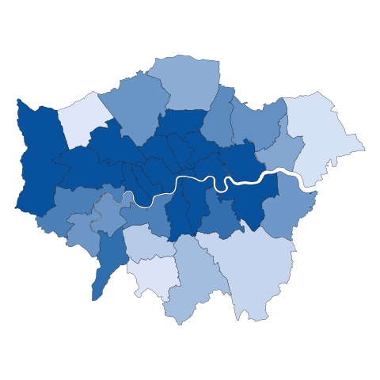

```{r setup, include=FALSE}

# the pacman library allows for other libraries to be loaded in fewer lines
library(pacman)

# using the pacman library to load other libraries:
p_load(tidyr, dplyr, xlsx, readxl, writexl, openxlsx, lubridate, stringr, ggplot2)

# #Load the dataframes in from the latest tables
input_path <- "Q:/ASCT/P005 Homelessness/008 Rough Sleeping/RS MI R/New monthly tables script/Git_Version/Publication_tables/Publication_tables241119.xlsx"

df_month_new <- readxl::read_excel(input_path, sheet = "Table_P1(b)_-_RS_month_new", skip = 3)
df_month <- readxl::read_excel(input_path, sheet = "Table_R1(b)_-_RS_month", skip = 3)
df_snapshot_new <- readxl::read_excel(input_path, sheet = "Table_P1(a)_-_RS_snapshot_new", skip = 3)
df_snapshot <- readxl::read_excel(input_path, sheet = "Table_R1(a)_-_RS_snapshot", skip = 3)
df_institutions <- readxl::read_excel(input_path, sheet = "Table_P2(a)_-_left_institutions", skip = 3)
df_month_rate <- readxl::read_excel(input_path, sheet = "Table_R1(d)_-_RS_month_rate", skip = 3)
df_accommodation <- readxl::read_excel(input_path, sheet ="Table_R2_-_RS_accommodation", skip =3)
df_long_term <- readxl::read_excel(input_path, sheet = "Table_B1_-_RS_monthly_long_term", skip = 3)
df_1_night <- readxl::read_excel(input_path, sheet = "Table_B2(a)_-_RS_1_night", skip = 3)
df_2_nights <- readxl::read_excel(input_path, sheet = "Table_B2(b)_-_RS_2_nights", skip = 3)
df_3_5_nights <- readxl::read_excel(input_path, sheet = "Table_B2(c)_-_RS_3_5_nights", skip = 3)
df_6_10_nights <- readxl::read_excel(input_path, sheet = "Table_B2(d)_-_RS_6_10_nights", skip = 3)
df_10_more_nights <- readxl::read_excel(input_path, sheet = "Table_B2(e)_-_RS_10_more_nights", skip = 3)
df_unknown_nights <- readxl::read_excel(input_path, sheet = "Table_B2(f)_-_RS_unknown_nights", skip = 3)
df_prison <- readxl::read_excel(input_path, sheet = "Table_P2(b)_-_RS_month_prison", skip = 3)
df_asylum <- readxl::read_excel(input_path, sheet = "Table_P2(f)_-_left_asylum", skip = 3)
df_hospital <- readxl::read_excel(input_path, sheet = "Table_P2(d)_-_left_hospital", skip = 3)
df_oja <- readxl::read_excel(input_path, sheet = "Table_P2(c)_-_left_OJA", skip = 3)
df_u25care <- readxl::read_excel(input_path, sheet = "Table_P2(g)_-_RS_under_25_care", skip = 3)
df_ukaf <- readxl::read_excel(input_path, sheet = "Table_P2(e)_-_left_UKAF", skip = 3)
df_month_rate <- readxl::read_excel(input_path, sheet = "Table_R1(d)_-_RS_month_rate", skip = 3)
df_snapshot_rate <- readxl::read_excel(input_path, sheet = "Table_R1(c)_-_RS_snapshot_rate", skip = 3)
df_returners <- readxl::read_excel(input_path, sheet = "Table_NR1_-_RS_returners", skip = 3)
df_prev_in_accomm <- readxl::read_excel(input_path, sheet = "Table_NR2_-_RS_prev_in_accomm", skip = 3)
df_nat <- readxl::read_excel(input_path, sheet = "Table_1_-_RS_Nationality", skip = 3)
df_imm <- readxl::read_excel(input_path, sheet = "Table_2_-_RS_Immigration", skip = 3)

colnames(df_month_new) <- colnames(df_month)
knitr::opts_chunk$set(echo = TRUE)

# Custom format function to include comma separator for numbers over 999
custom_format <- function(x) {
  if (is.numeric(x) & x > 999) {
    return(scales::comma(x))
  }
  return(x)
}

# Automatically apply commas to all numbers necessary
knitr::knit_hooks$set(inline = function(x) custom_format(x))

#Determines the month for publication, can be referenced in the following code 
this_month <- max(as.Date(paste0("01 ", names(df_month)), "%d %B %Y"), na.rm = T)
last_month <- format(lubridate::rollback(this_month - lubridate::dmonths(), roll_to_first = T), "%B %Y")
last_quarter <- format(lubridate::rollback(this_month - lubridate::dmonths(3), roll_to_first = T), "%B %Y")
last_year <- format(lubridate::rollback(this_month - lubridate::dyears(), roll_to_first = T), "%B %Y")
this_month <- format(this_month, "%B %Y")

# colours for graphs
af_colours <- c("#12436D", "#28A197", "#801650", "#F46A25", "#3D3D3D", "#A285D1", "#4a7555", "#d1194d", "#b8d453", "#8424e3")
shades_of_blue <- c("#000000", "#012169", "#4A6F9E", "#95B3D7", "#AFABAB", "#D0CECE")
publish_colours <-  c("#00625E", "#000000", "#932A72", "#205083", "#FAA332", "#FF5D88")

#Function to work out values for each driver this year, last quarter and last year (if used as not all variables have a years worth of data)
changes <- function(df, env = parent.frame()){
  name <- deparse(substitute(df))
  
  if(last_year %in% colnames(df)){
    
  #Create this month and monthly change
  this_month <- as.numeric(df[1, this_month])
  assign(paste0("this_month_",name), this_month, envir = env)
  
  last_month <- as.numeric(df[1, last_month])
  assign(paste0("last_month_",name), last_month, envir = env)
  
  monthly_change <- this_month - last_month
  assign(paste0("monthly_change_", name), monthly_change, envir = env)
  
  #Create last quarter
  last_quarter <- as.numeric(df[1, last_quarter])
  assign(paste0("last_quarter_",name), last_quarter, envir = env)

  #Create quarterly change
  quarterly_change <- this_month - last_quarter
  assign(paste0("quarterly_change_",name), quarterly_change, envir = env)
  
  #Create last year and annual change
  last_year <- as.numeric(df[1, last_year])
  assign(paste0("last_year_",name), last_year, envir = env)
  
  #Create annual change
  annual_change <- this_month - last_year
  assign(paste0("annual_change_",name), annual_change, envir = env)
  
  } else {
    
  #Create this month and monthly change
  this_month <- as.numeric(df[1, this_month])
  assign(paste0("this_month_",name), this_month, envir = env)
  
  last_month <- as.numeric(df[1, last_month])
  assign(paste0("last_month_",name), last_month, envir = env)

  monthly_change <- this_month - last_month
  assign(paste0("monthly_change_", name), monthly_change, envir = env)
  
  #Create last quarter
  last_quarter <- as.numeric(df[1, last_quarter])
  assign(paste0("last_quarter_",name), last_quarter, envir = env)

  #Create quarterly change
  quarterly_change <- this_month - last_quarter
  assign(paste0("quarterly_change_",name), quarterly_change, envir = env)
  
  }
  
  return(env)

}

#Create an environment to store the variables in
env1 <- new.env()

#Load all dataframes here then they can be accessed in the markdown below
changes(df_month, env = env1)
changes(df_long_term, env = env1)
changes(df_institutions, env = env1)
changes(df_month_new, env = env1)
changes(df_snapshot_new, env = env1)
changes(df_snapshot, env = env1)
changes(df_prison, env = env1)
changes(df_asylum, env = env1)
changes(df_hospital, env = env1)
changes(df_oja, env = env1)
changes(df_u25care, env = env1)
changes(df_ukaf, env = env1)
changes(df_month_rate, env = env1)
changes(df_snapshot_rate, env = env1)
changes(df_returners, env = env1)
changes(df_accommodation, env = env1)
changes(df_prev_in_accomm, env = env1)
changes(df_1_night, env = env1)
changes(df_2_nights, env = env1)
changes(df_3_5_nights, env = env1)
changes(df_6_10_nights, env = env1)
changes(df_10_more_nights, env = env1)
changes(df_unknown_nights, env = env1)
# in order to apply this function to nat and imm, they will need to be subset/renamed to avoid issues with there being 2 top rows
# so we will do it in the nat_imm chunk further down

#Function to work out increase or decrease
up_down <- function(num1, num2){
  if( num1 > num2 ){
    return("up")
  } else if( num2 > num1 ) {
    return("down")
  } else return("no change")
}

sign <- function(num){
  if (num > 0){
    return("up")
  } else if(num < 0){
    return("down")
  } else return("no change")
}


# for use in percentage calculations
r1_month <- df_month[[this_month]][1]

direction_2023_snapshot <- ifelse(get("this_month_df_snapshot", envir = env1) > 3898, "higher than",
                                  ifelse(get("this_month_df_snapshot", envir = env1) < 3898, "lower than",
                                         "the same as"))

# areas driving annual change
# this doesn't line up with what jon had so need some QAing before the calculations are used
r1_month_annual_change <- df_month %>%
  filter(LAD21CD != "---" & !is.na(LAD21CD),
         !is.na(RGN21NM),
         !is.na(RGN21CD)) %>%
  select(LAD21CD, all_of(last_year), all_of(this_month)) 

names(r1_month_annual_change)[2:3] <- c("last_year", "this_year")

r1_month_annual_change <- r1_month_annual_change %>%
  mutate(change = this_year - last_year,
         perc_of_tot_change = (change / get("annual_change_df_month", envir = env1)) * 100) %>%
  arrange(desc(perc_of_tot_change)) %>%
  mutate(cumulative_perc = cumsum(perc_of_tot_change)) 

n_50perc_r1_month <- nrow(r1_month_annual_change %>% filter(cumulative_perc <= 50)) + 1

# TODO: check n_50perc_r1_month and add into main findings text

# increases in how many areas?
n_increases_r1_month <- nrow(r1_month_annual_change %>% filter(change > 0))
perc_LAS_increases_r1_month <- round((n_increases_r1_month / 296) * 100)

# TODO: RMD the key drivers percentages


```
<br>
<br>

## 1. Main Findings

::: {custom-style="GreyBox"}
In `r this_month` there were `r get("this_month_df_month", envir = env1)` people estimated to be sleeping rough over the month - `r sign(get("annual_change_df_month", envir = env1))` `r get("annual_change_df_month", envir = env1)` people or `r round(((get("annual_change_df_month", envir = env1))/get("last_year_df_month", envir = env1))*100, digits = 0)`% since `r last_year` and `r sign(get("quarterly_change_df_month", envir = env1))` `r round((get("quarterly_change_df_month", envir = env1)/get("last_quarter_df_month", envir = env1)) * 100)`% on the last quarter publication in `r last_quarter`. Of these

<br>

* `r round(((get("this_month_df_month_new", envir = env1))/get("this_month_df_month", envir = env1))*100, digits = 0)`% were new people sleeping rough
* `r round((get("this_month_df_long_term", envir = env1) /  get("this_month_df_month", envir = env1))*100, digits = 0)`% were people who had been sleeping rough long term
* `r round((get("this_month_df_returners", envir = env1) /  get("this_month_df_month", envir = env1))*100, digits = 0)`% were people returning to sleeping rough and of these, `r round((get("this_month_df_prev_in_accomm", envir = env1) /  get("this_month_df_returners", envir = env1))*100, digits = 0)`% of people had moved into settled accommodation in the previous year
* `r round((get("this_month_df_institutions", envir = env1)/get("this_month_df_month", envir = env1))*100)`% of people sleeping rough had recently left an institution – `r round(((get("this_month_df_prison", envir = env1))/get("this_month_df_institutions", envir = env1))*100, digits = 0)`% of these people had recently left prison, and `r round(((get("this_month_df_asylum", envir = env1))/get("this_month_df_institutions", envir = env1))*100, digits = 0)`% had recently left asylum support services.
:::

::: {custom-style="GreyBox"}
`r round(get("this_month_df_month", envir = env1) / get("this_month_df_snapshot", envir = env1), digits = 1)` times more people sleep rough over the month compared to a single night. There were `r get("this_month_df_snapshot", envir = env1)` people estimated to be sleeping rough on a single night in `r this_month`, which is `r direction_2023_snapshot` the 2023 annual snapshot figure.
:::

::: {custom-style="GreyBox"}
Over half of the increase in rough sleeping over the month compared to last year has been driven by 12 areas but rough sleeping is increasing across majority of the country – rough sleeping has increased in `r perc_LAS_increases_r1_month`% of areas compared to last year.
:::

::: {custom-style="GreyBox"}
Key drivers are an increase in people sleeping rough long term, and people returning to sleeping rough. 

:::

<br>
<br>


## 2. Introduction

<br>
In May 2023, the Ministry of Housing, Communities and Local Government launched a new framework with a new set of metrics to better understand how far rough sleeping is **prevented** wherever possible, and where it does occur it is **rare**, **brief**, and **non-recurring**. This is the fourth quarterly publication of the framework and covers monthly information up to `r this_month`, for the first time including the final three core indicators: number of people sleeping rough who were accommodated over the month (R2), number of nights seen sleeping rough (B2) and number of people returning to sleeping rough after moving into settled accommodation (NR2). For the first time, this publication also contains information on nationality and immigration status of those sleeping rough, data on which has been collected every three months, starting in June 2024.

This data framework will be relevant to people working locally to reduce rough sleeping and is an important step towards driving better outcomes for vulnerable people.  

There are eight core indicators of the framework, including three which were rolled out nationally in June 2024, which are included for the first time in this publication.  

The eight core indicators are:

### Prevented

* The number of new people sleeping rough (on a single night and over the course of the month). This is known as P1.
* The number of people sleeping rough over the month who have been discharged from institutions, known as P2.

### Rare

* The number of people sleeping rough (on a single night and over the course of the month), known as R1.
* The number of people sleeping rough over the course of the month who have moved into accommodation over the course of the month, known as R2. 

### Brief

* The number of people sleeping rough over the course of the month who have been sleeping rough long term, known as B1.
* The number of nights on which people were seen sleeping rough, known as B2. 
 
### Non-Recurring

* The number of people sleeping rough over the course of the month who are returning to sleeping rough, known as NR1. 
* The number of people sleeping rough over the course of the month who are returning to sleeping rough, who had previously moved into settled accommodation, known as NR2. 


<br>


```{r image 1, echo=FALSE,warning = FALSE, message = FALSE}
knitr::include_graphics("images/indicator_breakdown_pub_graphic_all.png")
#knitr::include_graphics(system.file("rmd/images/Indicator_breakdown_pub_graphic_all.png", package = "ERSautomation"))

```


The number of people sleeping rough tends to be higher in the summer months when it is warmer, and lower in the winter months, reflecting the seasonality of rough sleeping.

<br>

::: {custom-style="GreyBox"}
**Date of next publication**: It is expected that the next quarterly publication of monthly data (up to December 2024) will be published in February 2025.
:::

<br>

## 3. Preventing people sleeping rough

There were `r get("this_month_df_month_new", envir = env1)` new people estimated to be sleeping rough over the month in `r this_month` (`r round(((get("this_month_df_month_new", envir = env1))/get("this_month_df_month", envir = env1))*100, digits = 0)`% of total people sleeping rough over the month) - `r sign(get("quarterly_change_df_month_new", envir = env1))` `r round(((get("quarterly_change_df_month_new", envir = env1))/get("last_quarter_df_month_new", envir = env1))*100, digits = 0)`% since `r last_quarter` and `r sign(get("annual_change_df_month_new", envir = env1))` `r round(((get("annual_change_df_month_new", envir = env1))/get("last_year_df_month_new", envir = env1))*100, digits = 0)`% since `r last_year`.

There were `r get("this_month_df_snapshot_new", envir = env1)` new people estimated to be sleeping rough on a single night in `r this_month` (`r round(((get("this_month_df_snapshot_new", envir = env1))/get("this_month_df_snapshot", envir = env1))*100, digits = 0)`% of total people sleeping rough on a single night) - `r sign(get("quarterly_change_df_snapshot_new", envir = env1))` `r round(((get("quarterly_change_df_snapshot_new", envir = env1))/get("last_quarter_df_snapshot_new", envir = env1))*100, digits = 0)`% since `r last_quarter` and `r sign(get("annual_change_df_snapshot_new", envir = env1))` `r round(((get("annual_change_df_snapshot_new", envir = env1))/get("last_year_df_snapshot_new", envir = env1))*100, digits = 0)`% on the same period last year. 


```{r fig 1 code - P1, include=FALSE}

 #Trim desired dataframes to the size wanted for figures
 new_month_tot <- as.vector(df_month_new[1, c(5:length(df_month_new))])
 new_snapshot_tot <- as.vector(df_snapshot_new[1, c(5:length(df_month_new))])
 
 #Change the dates to be datatype date
 convert_to_date <- function(colname) {
  # Parse the column name
  parsed_date <- as.Date(paste0("01 ", colname), format = "%d %B %Y")
  # Format the date as "YYYY_MM_DD"
  formatted_date <- format(parsed_date, "%Y_%m_%d")
  return(formatted_date)
}

  # Apply the function to dfs
  new_colnames <- sapply(colnames(new_month_tot), convert_to_date)

  # Update the column names of the data frame
  colnames(new_month_tot) <- new_colnames
  colnames(new_snapshot_tot) <- new_colnames

 #Create dataframe and transpose, needs to be in long format for charts
 new_comb <- dplyr::bind_rows(new_month_tot, new_snapshot_tot)
 transposed_new <- data.frame(t(new_comb))
 transposed_new <-  dplyr::mutate(transposed_new, "Date" = rownames(transposed_new))
 rownames(transposed_new) <- NULL
 colnames(transposed_new) <- c("New month", "New snapshot", "Date")
 new_df <- dplyr::mutate(transposed_new, Date = as.Date(Date, format = "%Y_%m_%d"),
        `New month` = as.numeric(`New month`),
        `New snapshot` = as.numeric(`New snapshot`))
   dplyr::select(new_df, 3, 2, 1)
new_df$Date <- as.Date(new_df$Date)
min_date <- min(new_df$Date)
max_date <- max(new_df$Date)

label_range <- new_df %>%
  dplyr::mutate(Year = format(Date, "%Y")) %>% 
  dplyr::group_by(Year) %>%
  dplyr::summarize(
    xmin = min(Date),
    xmax = max(Date),
    ymin = 0,  
    ymax = 3500   #
  )


label_range <- label_range %>%
  dplyr::mutate(xmid = as.Date((as.numeric(xmin) + as.numeric(xmax)) / 2, origin = "1970-01-01"))
# Rewriting with explicit package references

label_range <- dplyr::mutate(label_range, 
                             xmid = as.Date((as.numeric(xmin) + as.numeric(xmax)) / 2, origin = "1970-01-01"))

figure_1 <- ggplot2::ggplot(new_df, ggplot2::aes(x = Date)) +
  ggplot2::geom_line(ggplot2::aes(y = `New snapshot`, color = "Snapshot_new"), size = 1.4, group = 1) +
  ggplot2::geom_point(ggplot2::aes(y = `New snapshot`), color = "#012169", size = 3) +  # Add points for Snapshot_new
  ggplot2::geom_line(ggplot2::aes(y = `New month`, color = "Month_new"), size = 1.4, group = 1) +
  ggplot2::geom_point(ggplot2::aes(y = `New month`), color = "#95B3D7", size = 3) +
  ggplot2::geom_rect(data = label_range, ggplot2::aes(xmin = xmin, xmax = xmax, ymin = ymin, ymax = ymax, group = Year),
                     fill = "white", color = NA, alpha = 0, inherit.aes = FALSE) +
  ggplot2::geom_text(data = label_range, ggplot2::aes(x = xmid, y = ymin - 150, label = Year, group = Year),
                     color = "#636363", size = 3.5, angle = 0, hjust = 0.5, inherit.aes = FALSE) +
  ggplot2::labs(title = NULL, x = "Date", y = "Number of people") +
  ggplot2::theme(legend.position = "none") +
  ggplot2::scale_color_manual(values = c("Snapshot_new" = "#012169", "Month_new" = "#95B3D7")) +
  dluhctheme::dluhc_style(size = 1.5) +
  ggplot2::scale_y_continuous(breaks = seq(0, 3500, by = 500), labels = scales::comma, limits = c(-150, 3500)) +
  ggplot2::scale_x_date(labels = scales::date_format("%b"), date_breaks = "1 month", limits = c(min_date, max_date), expand = c(0, 10)) +
  ggplot2::theme(
    axis.text.x = ggplot2::element_text(angle = 90, hjust = 0, vjust = 0.5, family = "Arial", color = "#636363", size = 11),
    axis.text.y = ggplot2::element_text(family = "Arial", color = "#636363", size = 10),
    panel.grid.major = ggplot2::element_line(color = "#F2F2F2", size = 0.3, linetype = "solid"),   
    panel.grid.major.y = ggplot2::element_line(color = "#F2F2F2", size = 0.3, linetype = "solid"),
    axis.ticks = ggplot2::element_line(color = "#F2F2F2", size = 0.3)
  ) +
  ggplot2::theme(legend.position = "none") +
  ggplot2::geom_text(data = new_df[1, ], ggplot2::aes(x = Date, y = `New snapshot`, label = "          New people sleeping\n rough on a single night (P1)"), 
                     color = "#012169", vjust = -2, hjust = -2.5, size = 3.5) +
  ggplot2::geom_text(data = new_df[1, ], ggplot2::aes(x = Date, y = `New month`, label = "        New people sleeping\n rough over the month (P1)"),
                     color = "#012169", vjust = -6.4, hjust = -2.1, size = 3.5)

 # print(figure_1)
 
 
 output_folder <- "images" # this should just look for the folder inside the folder you currently are in i.e. repo/inst/rmd
if (!dir.exists(output_folder)) { 
  dir.create(output_folder, recursive = TRUE)
  print("created folder")
} else { print("folder already exists")} 
 
 # specify desired folder path 
 ggplot2::ggsave("images/figure_1.svg", plot = figure_1, width = 8, height = 6)
 ggplot2::ggsave("images/figure_1.png", plot = figure_1, width = 8, height = 6, dpi = 300)

 
```

**Figure 1: Estimated number of new people sleeping rough, October 2020 to `r this_month` (P1)**

```{r line new, echo=FALSE,warning = FALSE, message = FALSE}

knitr::include_graphics("images/figure_1.svg")

# knitr::include_graphics(system.file("rmd/images/figure_1.svg",  package = "ERSautomation"))

```
<br>

**Source: MHCLG**


There were `r get("this_month_df_institutions", envir = env1)` people estimated to be sleeping rough over the month in `r this_month` who had left an institution (`r round(((get("this_month_df_institutions", envir = env1))/get("this_month_df_month", envir = env1))*100, digits = 0)`% of total). Of these:

*  `r get("this_month_df_prison", envir = env1)` people (`r round(((get("this_month_df_prison", envir = env1))/get("this_month_df_institutions", envir = env1))*100, digits = 0)`% of people who had left an institution) had left prison in the last 85 days - `r sign(get("quarterly_change_df_prison", envir = env1))` `r round(((get("quarterly_change_df_prison", envir = env1))/get("last_quarter_df_prison", envir = env1))*100, digits = 0)`% since `r last_quarter`. 

*  `r get("this_month_df_asylum", envir = env1)` people (`r round(((get("this_month_df_asylum", envir = env1))/get("this_month_df_institutions", envir = env1))*100, digits = 0)`% of people who had left an institution) had left asylum support (previously 'National Asylum Support Services') in the last 85 days - `r sign(get("quarterly_change_df_asylum", envir = env1))` `r round(abs(((get("quarterly_change_df_asylum", envir = env1))/get("last_quarter_df_asylum", envir = env1)))*100, digits = 0)`% since `r last_quarter`. 

*  `r get("this_month_df_hospital", envir = env1)` people (`r round(((get("this_month_df_hospital", envir = env1))/get("this_month_df_institutions", envir = env1))*100, digits = 0)`% of people who had left an institution) had left General & Psychiatric hospitals in the last 85 days - `r sign(get("quarterly_change_df_hospital", envir = env1))` `r round(abs(((get("quarterly_change_df_hospital", envir = env1))/get("last_quarter_df_hospital", envir = env1)))*100, digits = 0)`% since `r last_quarter`. 

*  `r get("this_month_df_u25care", envir = env1)` people (`r round(((get("this_month_df_u25care", envir = env1))/get("this_month_df_institutions", envir = env1))*100, digits = 0)`% of people who had left an institution) were care leavers aged under 25 - `r sign(get("quarterly_change_df_u25care", envir = env1))` `r round(((get("quarterly_change_df_u25care", envir = env1))/get("last_quarter_df_u25care", envir = env1))*100, digits = 0)`% since `r last_quarter`. 

*  `r get("this_month_df_oja", envir = env1)` people (`r round(((get("this_month_df_oja", envir = env1))/get("this_month_df_institutions", envir = env1))*100, digits = 0)`% of people who had left an institution) had left other justice accommodation within the last 85 days - `r sign(get("quarterly_change_df_oja", envir = env1))` `r round(((get("quarterly_change_df_oja", envir = env1))/get("last_quarter_df_oja", envir = env1))*100, digits = 0)`% since `r last_quarter`. 

*  `r get("this_month_df_ukaf", envir = env1)` people (`r round(((get("this_month_df_ukaf", envir = env1))/get("this_month_df_institutions", envir = env1))*100, digits = 1)`% of people who had left an institution) had left the UK armed forces within the last 85 days. 

<br>

```{r 4-Figure 2 P2, include=FALSE}

# Load Arial font
sysfonts::font_add("Arial", "Arial.ttf")
showtext::showtext_auto()

#Access env1
this_month_df_prison <- get("this_month_df_prison", envir = env1)
this_month_df_asylum <- get("this_month_df_asylum", envir = env1)
this_month_df_hospital <- get("this_month_df_hospital", envir = env1)
this_month_df_u25care <- get("this_month_df_u25care", envir = env1)
this_month_df_oja <- get("this_month_df_oja", envir = env1)
this_month_df_ukaf <- get("this_month_df_ukaf", envir = env1)

#Create dataframe
donut_data <- data.frame(
  Institutions = c("Prison", "Asylum support", "General or psychiatric hospitals", "Under 25 care leavers", "Other justice accommodation", "UK armed forces"),
  this_month_inst =  c(this_month_df_prison, this_month_df_asylum, this_month_df_hospital, this_month_df_u25care, this_month_df_oja, this_month_df_ukaf)
)


##FIX BELOW FOR ROUNDING OF VALUES THAT ARE SMALL
conditional_round <- function(x) {
  if (x < 0.01) {
    # Round to 1 digit if value equals zero
    return(round(x, digits = 3))
  } else {
    # Round to 0 digits if value is greater than zero
    return(round(x, digits = 2))
  }
}

# percentages
donut_data$fraction = donut_data$this_month_inst / sum(donut_data$this_month_inst)
donut_data$label = sapply((donut_data$fraction), conditional_round)*100

#Function to format to 1 dp if less than 1
format_label <- function(value) {
  if (value < 1) {
    return(sprintf("%.1f", value))  # Format to 1 decimal place
  } else {
    return(sprintf("%.0f", value))  # Format to 0 decimal places
  }
}

donut_data$label <- sapply(donut_data$label, format_label)

#cumulative %s
donut_data$ymax = cumsum(donut_data$fraction)

# Get bottom of each rectangle
donut_data$ymin = c(0, head(donut_data$ymax, n=-1))

#label position
donut_data$labelPosition <- (donut_data$ymax + donut_data$ymin) / 2
donut_data$labelPosition
#a good label
donut_data$label <- paste0(donut_data$label, "%")

#colour lables
colors <- c("Prison" = "#000000", "Asylum support" = "#012169", "General or psychiatric hospitals" = "#4A6F9E", "Under 25 care leavers" = "#95B3D7", "Other justice accommodation" = "#AFABAB", "UK armed forces" = "#D0CECE")

#total value for centre label
total_value <- sum(donut_data$this_month_inst)

#Change label position of UKAF
donut_data[6,7] <- 1

#Trial

donut_data$custom_labelPosition <- ifelse(donut_data$Institutions == "UK armed forces", 1, (donut_data$ymax + donut_data$ymin) / 2)
original_label_position <- donut_data$labelPosition[donut_data$Institutions == "UK armed forces"]


figure_2 <- ggplot2::ggplot(donut_data, ggplot2::aes(ymax = ymax, ymin = ymin, xmax = 5, xmin = 3.25, fill = Institutions)) +
  ggplot2::geom_rect() +
  ggplot2::geom_text(data = subset(donut_data, Institutions != "UK armed forces"), ggplot2::aes(x = 4, y = labelPosition, label = label), size = 4, color = "white") +
  ggplot2::geom_text(data = subset(donut_data, Institutions == "UK armed forces"), ggplot2::aes(x = 5.75, y = custom_labelPosition, label = label), size = 4, color = "#767171") +
  ggplot2::geom_segment(data = subset(donut_data, Institutions == "UK armed forces"), ggplot2::aes(x = 4, y = original_label_position, xend = 5.45, yend = custom_labelPosition), color = "#767171", size = 0.5) +
  ggplot2::coord_polar(theta = "y") +
  ggplot2::xlim(c(0, 6)) +
  ggplot2::scale_fill_manual(values = colors) + 
  ggplot2::theme_void() +
  ggplot2::theme(
    text = ggplot2::element_text(family = "Arial", color = "#7F7F7F"),
    legend.position = "bottom",
    legend.title = ggplot2::element_blank(),
    legend.margin = ggplot2::margin(t = -25, b = 0, l = 0, r = 0),
    legend.box.margin = ggplot2::margin(t = -25, b = 10, l = 0, r = 0)) +
  ggplot2::annotate("text", x = 1, y = 0, label = total_value, size = 18, color = "#012169", fontface = "bold") +
  ggplot2::annotate("text", x = 0, y = 0, label = "\n \n \n People sleeping rough \n over the month who left\n an institution", size = 4, color = "#767171", fontface = "bold", family = "Arial")

#print(figure_2)

#Old version - before label for small numbers was added
# #Compute percentages
# donut_data$fraction = donut_data$this_month_inst / sum(donut_data$this_month_inst)
# donut_data$label = round((donut_data$this_month_inst / sum(donut_data$this_month_inst))*100, digits = 0 )
# 
# #Compute cumulative %s
# donut_data$ymax = cumsum(donut_data$fraction)
# 
# # Compute the bottom of each rectangle
# donut_data$ymin = c(0, head(donut_data$ymax, n=-1))
# 
# # Compute label position
# donut_data$labelPosition <- (donut_data$ymax + donut_data$ymin) / 2
# 
# # Compute a good label
# donut_data$label <- paste0(donut_data$label, "%")
# 
# #colour lables
# colors <- c("Prison" = "#000000", "Asylum support" = "#012169", "General or psychiatric hospitals" = "#4A6F9E", "Under 25 care leavers" = "#95B3D7", "Other justice accommodation" = "#AFABAB", "UK armed forces" = "#D0CECE")
# 
# #total value for centre label
# total_value <- sum(donut_data$this_month_inst)
# 
# # Make the plot
# figure_2 <- ggplot2::ggplot(donut_data, ggplot2::aes(ymax=ymax, ymin=ymin, xmax=4, xmin=3, fill=Institutions)) +
#   geom_rect() +
#   geom_text(ggplot2::aes(x=3.5, y=labelPosition, label=label), size=4, color = "white") +
#   coord_polar(theta="y") +
#   ggplot2::xlim(c(1, 4)) +
#   ggplot2::scale_fill_manual(values = colors) + 
#   theme_void() +
#   theme(
#     text = element_text(family = "Arial", color = "#7F7F7F"),
#     legend.position = "bottom",
#     legend.title = element_blank())+
#   annotate("text", x = 1.5, y = 0, label = total_value, size = 18, color = "#012169", fontface = "bold")+
#   annotate("text", x = 1, y = 0 , label = "\n \n \n People sleeping rough \n over the month who left\n an institution", size = 4, color = "#767171", fontface = "bold", family = "Arial")
# 
# print(figure_2)
# 

  ggplot2::ggsave("images/figure_2.svg", plot = figure_2, width = 8, height = 6)
  ggplot2::ggsave("images/figure_2.png", plot = figure_2, width = 8, height = 6, dpi = 300)

```


**Figure 2: Estimated number of people sleeping rough over the course of the month who have left an institution, `r this_month` (P2)**

```{r figure 2, echo=FALSE, warning = FALSE, message = FALSE}

knitr::include_graphics("images/figure_2.svg")
# knitr::include_graphics(system.file("rmd/inst/rmd/images/figure_2.svg",  package = "ERSautomation"))

```

```{r 4-Figure 3 P2, include=FALSE}

#Bind into one df
inst_all <- dplyr::bind_rows(
  as.vector(df_prison[1, ]),
  as.vector(df_oja[1, ]),
  as.vector(df_hospital[1, ]),
  as.vector(df_ukaf[1, ]),
  as.vector(df_asylum[1, ]),
  as.vector(df_u25care[1, c(18:length(df_u25care))])
) %>%
  dplyr::select(-c(1:4))  # update when you need new data included

# Convert date formats
start_date <- as.Date("2023-05-01")
num_months <- ncol(inst_all)

dates <- seq(from = start_date, by = "month", length.out = num_months)
formatted_dates <- format(dates, "%Y_%m_%d")
colnames(inst_all) <- formatted_dates

# Wrangling to get into the desired format
transposed <- data.frame(t(inst_all))
transposed <- dplyr::mutate(transposed, "Date" = rownames(transposed))
rownames(transposed) <- NULL
colnames(transposed) <- c(
  "Prison (adult or youth)", "Other justice accommodation",
  "General or Psychiatric Hospital", "UK Armed Forces",
  "Asylum Support", "Under 25 care leavers", "Date"
)

institutions_data <- transposed %>%
  dplyr::mutate(
    Date = as.Date(Date, format = "%Y_%m_%d"),
    `Prison (adult or youth)` = as.numeric(`Prison (adult or youth)`),
    `Other justice accommodation` = as.numeric(`Other justice accommodation`),
    `General or Psychiatric Hospital` = as.numeric(`General or Psychiatric Hospital`),
    `UK Armed Forces` = as.numeric(`UK Armed Forces`),
    `Asylum Support` = as.numeric(`Asylum Support`),
    `Under 25 care leavers` = as.numeric(`Under 25 care leavers`)
  )

label_range_3 <- institutions_data %>%
  dplyr::mutate(Year = format(Date, "%Y")) %>%
  dplyr::group_by(Year) %>%
  dplyr::summarize(
    xmin = min(Date),
    xmax = max(Date),
    ymin = 0,
    ymax = 600
  )

label_range_3 <- label_range_3 %>%
  dplyr::mutate(xmid = as.Date((as.numeric(xmin) + as.numeric(xmax)) / 2, origin = "1970-01-01"))

# Figure 3
figure_3 <- ggplot2::ggplot(institutions_data, ggplot2::aes(x = Date)) +
  ggplot2::geom_line(ggplot2::aes(y = `Prison (adult or youth)`, color = "Prison (adult or youth)"), size = 1.4, group = 1) +
  ggplot2::geom_point(ggplot2::aes(y = `Prison (adult or youth)`), color = "#000000", size = 3) +
  ggplot2::geom_line(ggplot2::aes(y = `Other justice accommodation`, color = "Other justice accommodation"), size = 1.4, group = 1) +
  ggplot2::geom_point(ggplot2::aes(y = `Other justice accommodation`), color = "#12239E", size = 3) +
  ggplot2::geom_line(ggplot2::aes(y = `General or Psychiatric Hospital`, color = "General or Psychiatric Hospital"), size = 1.4, group = 1) +
  ggplot2::geom_point(ggplot2::aes(y = `General or Psychiatric Hospital`), color = "#118DFF", size = 3) +
  ggplot2::geom_line(ggplot2::aes(y = `UK Armed Forces`, color = "UK Armed Forces"), size = 1.4, group = 1) +
  ggplot2::geom_point(ggplot2::aes(y = `UK Armed Forces`), color = "#A0D1FF", size = 3) +
  ggplot2::geom_line(ggplot2::aes(y = `Asylum Support`, color = "Asylum Support"), size = 1.4, group = 1) +
  ggplot2::geom_point(ggplot2::aes(y = `Asylum Support`), color = "#E6E6E6", size = 3) +
  ggplot2::geom_line(ggplot2::aes(y = `Under 25 care leavers`, color = "Under 25 care leavers"), size = 1.4, group = 1) +
  ggplot2::geom_point(ggplot2::aes(y = `Under 25 care leavers`), color = "#EFB5B9", size = 3) +
  ggplot2::geom_rect(data = label_range_3, ggplot2::aes(xmin = xmin, xmax = xmax, ymin = ymin, ymax = ymax, group = Year),
    fill = "white", color = NA, alpha = 0, inherit.aes = FALSE
  ) +
  ggplot2::geom_text(data = label_range_3, ggplot2::aes(x = xmid, y = ymin - 50, label = Year, group = Year),
    color = "#636363", size = 3.5, angle = 0, hjust = 0.5, inherit.aes = FALSE
  ) +
  dluhctheme::dluhc_style(size = 1.5) +
  ggplot2::scale_y_continuous(breaks = seq(0, 500, by = 50), labels = scales::comma) +
  ggplot2::scale_x_date(labels = scales::date_format("%b"), date_breaks = "1 month", expand = c(0, 8)) +
  ggplot2::theme(
    axis.text.x = ggplot2::element_text(angle = 0, hjust = 1, vjust = 0.5, family = "Arial", color = "#636363", size = 10),
    axis.text.y = ggplot2::element_text(family = "Arial", color = "#636363", size = 10),
    panel.grid.major = ggplot2::element_line(color = "#F2F2F2", size = 0.3, linetype = "solid"),
    panel.grid.major.y = ggplot2::element_line(color = "#F2F2F2", size = 0.3, linetype = "solid"),
    text = ggplot2::element_text(family = "Arial", color = "#7F7F7F"),
    axis.ticks = ggplot2::element_line(color = "#F2F2F2", size = 0.3),
    legend.position = "bottom",
    legend.title = ggplot2::element_blank(),
    legend.margin = ggplot2::margin(t = -5, b = 0, l = 0, r = 0),
    legend.box.margin = ggplot2::margin(t = -5, b = 10, l = 0, r = 0),
    legend.text = ggplot2::element_text(family = "Arial", color = "#7F7F7F", size = 10)
  ) +
  ggplot2::guides(fill = ggplot2::guide_legend(override.aes = list(shape = 21, size = 5))) +
  ggplot2::scale_color_manual(values = c(
    "Prison (adult or youth)" = "#000000", "Other justice accommodation" = "#12239E",
    "General or Psychiatric Hospital" = "#118DFF", "UK Armed Forces" = "#A0D1FF",
    "Asylum Support" = "#E6E6E6", "Under 25 care leavers" = "#EFB5B9"
  ))


 ggplot2::ggsave("images/figure_3.svg", plot = figure_3, width = 8, height = 6)
 ggplot2::ggsave("images/figure_3.png", plot = figure_3, width = 8, height = 6, dpi = 300)

 
```


<br>

**Source: MHCLG**

<br>

**Figure 3: Estimated number of people sleeping rough over the course of the month who have left an institution, May 2023 to `r this_month` (P2)**

```{r figure 3, echo=FALSE, warning = FALSE, message = FALSE}

knitr::include_graphics("images/figure_3.svg")
#knitr::include_graphics(system.file("rmd/inst/rmd/images/figure_3.svg", package = "ERSautomation"))

```

<br>

**Source: MHCLG**

<br>

## 4. Making rough sleeping rare

There were `r get("this_month_df_month", envir = env1)` people estimated to be sleeping rough over the month of `r this_month` – `r sign(get("quarterly_change_df_month", envir = env1))` `r get("quarterly_change_df_month", envir = env1)` people or `r round(((get("quarterly_change_df_month", envir = env1))/get("last_quarter_df_month", envir = env1))*100, digits = 0)`% since `r last_quarter` and `r sign(get("annual_change_df_month", envir = env1))` `r get("annual_change_df_month", envir = env1)` people or `r round(((get("annual_change_df_month", envir = env1))/get("last_year_df_month", envir = env1))*100, digits = 0)`% since `r last_year`. 

This is `r round(get("this_month_df_month", envir = env1) / get("this_month_df_snapshot", envir = env1), digits = 1)` times higher than the number of people seen sleeping rough on a single night, illustrating that the flow of people onto and off the street over the course of a month is significantly higher than those seen on any given night due to the dynamic nature of rough sleeping.

The rate of people sleeping rough over the month of `r this_month` in England was  `r round(get("this_month_df_month_rate", envir = env1), digits = 1)` people per 100,000, compared to `r round(get("last_quarter_df_month_rate", envir = env1), digits = 1)` people per 100,000 in the `r last_quarter` and `r round(get("last_year_df_month_rate", envir = env1), digits = 1)` people per 100,00 in the same period last year[^1].


There were `r get("this_month_df_snapshot", envir = env1)` people estimated to be sleeping rough on a single night in `r this_month` - `r sign( get("quarterly_change_df_snapshot", envir = env1))` `r get("quarterly_change_df_snapshot", envir = env1)` people or  `r round(((get("quarterly_change_df_snapshot", envir = env1))/get("last_quarter_df_snapshot", envir = env1))*100, digits = 0)`% since `r last_quarter` and `r sign(get("annual_change_df_snapshot", envir = env1))` `r get("annual_change_df_snapshot", envir = env1)` people or `r round(((get("annual_change_df_snapshot", envir = env1))/get("last_year_df_snapshot", envir = env1))*100, digits = 0)`% since last year. 

The rate of people estimated to be sleeping rough on a single night in `r this_month` in England was `r round(get("this_month_df_snapshot_rate", envir = env1), digits = 1)` people per 100,000, compared to `r round(get("last_quarter_df_snapshot_rate", envir = env1), digits = 1)` people per 100,000 in the previous quarter (`r last_quarter`) and `r round(get("last_year_df_snapshot_rate", envir = env1), digits = 1)` people per 100,000 in the same period last year.


**Figure 4: Estimated number of people sleeping rough, October 2020 to `r this_month` (R1)**

```{r 4-Figure 4 R1, include=FALSE}

month_tot <- as.vector(df_month[1, c(5:ncol(df_month))])

snapshot_tot <- as.vector(df_snapshot[1, c(5:ncol(df_snapshot))])
# there might be a mismatch between number of cols in month and snapshot, so add NAs for older months for monthly

excess_months <- dplyr::setdiff(names(snapshot_tot), names(month_tot))

# Apply the function to dfs
# these two should be identical
month_date_colnames <- sapply(colnames(month_tot), convert_to_date)
snapshot_date_colnames <- sapply(colnames(snapshot_tot), convert_to_date)

# Update the column names of the data frame
colnames(month_tot) <- month_date_colnames
colnames(snapshot_tot) <- snapshot_date_colnames

month_tot <- as.data.frame(month_tot) %>%
  dplyr::mutate(across(everything(), as.numeric))

snapshot_tot <- as.data.frame(snapshot_tot) %>%
  dplyr::mutate(across(everything(), as.numeric))

comb <- dplyr::bind_rows(month_tot, 
                         snapshot_tot)

transposed <- data.frame(t(comb))
transposed <- dplyr::mutate(transposed, "Date" = rownames(transposed))
rownames(transposed) <- NULL
colnames(transposed) <- c("Month", "Snapshot", "Date")

df <- transposed %>%
  dplyr::mutate(
    Date = as.Date(Date, format = "%Y_%m_%d"),
    `Month` = as.numeric(`Month`),
    `Snapshot` = as.numeric(`Snapshot`)
  ) %>%
  dplyr::select(3, 2, 1)

# Update the below with the above data frames

label_range_4 <- df %>%
  dplyr::mutate(Year = format(Date, "%Y")) %>%
  dplyr::group_by(Year) %>%
  dplyr::summarize(
    xmin = min(Date),
    xmax = max(Date),
    ymin = 0,
    ymax = 10000
  )

label_range_4 <- label_range_4 %>%
  dplyr::mutate(xmid = as.Date((as.numeric(xmin) + as.numeric(xmax)) / 2, origin = "1970-01-01"))

# Figure 4
figure_4 <- ggplot2::ggplot(df, ggplot2::aes(x = Date)) +
  ggplot2::geom_line(ggplot2::aes(y = `Snapshot`, color = "Snapshot"), size = 1.4, group = 1) +
  ggplot2::geom_point(ggplot2::aes(y = `Snapshot`), color = "#012169", size = 3) +
  ggplot2::geom_line(ggplot2::aes(y = `Month`, color = "Month"), size = 1.4, group = 1) +
  ggplot2::geom_point(ggplot2::aes(y = `Month`), color = "#95B3D7", size = 3) +
  ggplot2::geom_rect(data = label_range_4, ggplot2::aes(xmin = xmin, xmax = xmax, ymin = ymin, ymax = ymax, group = Year),
    fill = "white", color = NA, alpha = 0, inherit.aes = FALSE
  ) +
  ggplot2::geom_text(data = label_range_4, ggplot2::aes(x = xmid, y = ymin - 300, label = Year, group = Year),
    color = "#636363", size = 3.5, angle = 0, hjust = 0.5, inherit.aes = FALSE
  ) +
  ggplot2::labs(title = NULL, x = "Date", y = "Number of people") +
  ggplot2::theme(legend.position = "none") +
  ggplot2::scale_color_manual(values = c("Snapshot" = "#012169", "Month" = "#95B3D7")) +
  dluhctheme::dluhc_style(size = 1.5) +
  ggplot2::scale_y_continuous(breaks = seq(0, 10000, by = 1000), labels = scales::comma, 
                              limits = c(-300, 10000)) +
                              
  ggplot2::scale_x_date(labels = scales::date_format("%b"), date_breaks = "1 month", expand = c(0, 10)) +
  ggplot2::theme(
    axis.text.x = ggplot2::element_text(angle = 90, hjust = 0, vjust = 0.5, family = "Arial", color = "#636363", size = 10),
    axis.text.y = ggplot2::element_text(family = "Arial", color = "#636363", size = 10),
    panel.grid.major = ggplot2::element_line(color = "#F2F2F2", size = 0.3, linetype = "solid"),
    panel.grid.major.y = ggplot2::element_line(color = "#F2F2F2", size = 0.3, linetype = "solid"),
    axis.ticks = ggplot2::element_line(color = "#F2F2F2", size = 0.3)
  ) +
  ggplot2::theme(legend.position = "none") +
  ggplot2::geom_text(data = df[1, ], ggplot2::aes(x = Date, y = `Snapshot`, label = " Number of people \n sleeping rough on \n a single night (R1)"),
    color = "#012169", vjust = -0.8, hjust = -3.7, size = 3.5
  ) +
  ggplot2::geom_text(data = df[1, ], ggplot2::aes(x = Date, y = `Month`, label = "   Number of people \n sleeping rough over \n       the month (R1)"),
    color = "#012169", vjust = -2.7, hjust = -1.85, size = 3.5)

ggplot2::ggsave("images/figure_4.svg", plot = figure_4, width = 8, height = 6)
ggplot2::ggsave("images/figure_4.png", plot = figure_4, width = 8, height = 6, dpi = 300)
 
```

```{r figure 4, echo=FALSE, warning = FALSE, message = FALSE}

knitr::include_graphics("images/figure_4.svg")
#knitr::include_graphics(system.file("rmd/inst/rmd/images/figure_4.svg", package = "ERSautomation"))

```

<br>

**Source: MHCLG**


```{r figure 6,  include=FALSE}

# Script to create maps for the info graphic
latest_column <- which(names(df_snapshot) == this_month)
  
#This is for rate 
# I assume this is recreating rates from the snapshot df rather than using the rates that are in the original df_snapshot_rate column?
# bit confused because the df used in the next chunk starts with the monthly rate
df_snapshot_rate <- df_snapshot %>%
  dplyr::select(c(1, 2, 3, all_of(latest_column)))

colnames(df_snapshot_rate) <- c("LAD23NM", "LAD23CD", "Region", "snapshot")

England <- sf::st_read("England_map_2023/LAD_MAY_2023_UK_BGC_V2.shp")

England <- England %>%
  dplyr::left_join(df_snapshot_rate, by = dplyr::join_by(LAD23CD))

England <- England %>%
  dplyr::filter(!is.na(England$snapshot))

England_map <- England %>%
  tmap::tm_shape() +
  tmap::tm_fill(
  "snapshot", 
  style = "cont",  # Keep continuous style
  breaks = c(0, 20),  # Only showing 0 and 20+ in legend
  labels = c("0", "20+"),  # Simplify legend labels
  palette = c("#EFF3FF", "#08519C"),  # Continuous palette from light to dark
  #title = "People sleeping \nrough per 100k \npopulation"
) +
tmap::tm_borders(lwd = 0.1, lty = "solid", alpha = 1) +
tmap::tm_style("col_blind") +
tmap::tm_layout(
  frame = FALSE, 
  frame.lwd = NA, 
  panel.label.bg.color = NA,
  legend.position = c("right", "top"),
  legend.outside = TRUE,
  legend.outside.position = "right",
  legend.text.size = 0.5,
  legend.title.size = 0.7,
  legend.width = 0.9,
  legend.height = 2,
  legend.bg.color = NA,
  legend.show = FALSE
)


#Use England shape files, this will need updating if there's boundary changes
tmap::tmap_save(England_map, "images/England_map.png", width=1000, height=1000, asp=0)
tmap::tmap_save(England_map, "images/England_map.svg", width=2000, height=2000, asp=0)


#Adjust for London

#Create London dataframe
London <- df_snapshot_rate[ c(12:307), ] %>% # i.e. not incuding regions
  dplyr::filter(Region == "London")

#Join with shape file and remove any values not in London
London_join <- England %>%
  dplyr::left_join(London, by = dplyr::join_by(LAD23CD))

London_join <- London_join %>%
  dplyr::filter(!is.na(London_join$snapshot.y))

London_map <- London_join %>%
  tmap::tm_shape() +
  tmap::tm_fill("snapshot.y", style = "cont", breaks = c(0,20),
          labels = c("0","20+"),
          palette = c("#EFF3FF", "#08519C"),
          legend.show = FALSE) +
  tmap::tm_borders(lwd = 0.4, lty = "solid", alpha = 1)+
  tmap::tm_style("col_blind")+
  tmap::tm_layout(frame = FALSE, frame.lwd = NA, panel.label.bg.color = NA)

tmap::tmap_save(London_map, "images/London_map.png", width=2000, height=2000, asp=0)
tmap::tmap_save(London_map, "images/london_map.svg", width=2000, height=2000, asp=0)

```
<br>

**Figure 5: Map of rate of people sleeping rough on a single night per 100,000 people (R1), `r this_month`** 

```{r figure 6 - map, echo=FALSE,}
knitr::include_graphics("images/England_map.svg")
#knitr::include_graphics(system.file("rmd/inst/rmd/images/.svg",  package = "ERSautomation"))
knitr::include_graphics("images/London_map.svg")
#knitr::include_graphics(system.file("rmd/inst/rmd/images/London_map.svg",  package = "ERSautomation"))

```

**Source: MHCLG**
<br>

```{r figure_7, include = FALSE}

latest_column <- which(names(df_month_rate) == this_month)

df_month_rate <- df_month_rate %>%
  dplyr::select(c(1, 2, 3, all_of(latest_column)))

colnames(df_month_rate) <- c("LAD23NM", "LAD23CD", "Region", "month")

England <- sf::st_read("England_map_2023/LAD_MAY_2023_UK_BGC_V2.shp")

England <- England %>%
  dplyr::left_join(df_month_rate,  by = dplyr::join_by(LAD23CD))

England <- England %>%
  dplyr::filter(!is.na(England$month))

England_map_rate <- England %>%
  tmap::tm_shape() +
  tmap::tm_fill("month", style = "cont", breaks = c(0,20),
          labels = c("0","20"),
          palette = c("#EFF3FF", "#08519C"))+
          #title = "People") +
  tmap::tm_borders(lwd = 0.1, lty = "solid", alpha = 1) +
  tmap::tm_style("col_blind") +
tmap::tm_layout(
  frame = FALSE, 
  frame.lwd = NA, 
  panel.label.bg.color = NA,
  legend.position = c("right", "top"),
  legend.outside = TRUE,
  legend.outside.position = "right",
  legend.text.size = 0.5,
  legend.title.size = 0.7,
  legend.width = 0.9,
  legend.height = 2,
  legend.bg.color = NA,
  legend.show = FALSE
)

tmap::tmap_save(England_map_rate, "images/England_map_rate.png", width=2000, height=2000, asp=0)
tmap::tmap_save(England_map_rate, "images/England_map_rate.svg", width=2000, height=2000, asp=0)

#Adjust for London

#Create London dataframe
London <- df_month_rate[ c(12:307), ] %>% # no regions
  dplyr::filter(Region == "London")

#Join with shape file and remove any values not in London
London_join <- England %>%
  dplyr::left_join(London,  by = dplyr::join_by(LAD23CD))

London_join <- London_join %>%
  dplyr::filter(!is.na(London_join$month.y))

London_map_rate <- London_join %>%
  tmap::tm_shape() +
  tmap::tm_fill("month.y", style = "cont", breaks = c(0, 20),
          labels = c("0","20+"),
          palette = c("#EFF3FF","#08519C"),
          title = "People",
          legend.show = FALSE) +
  tmap::tm_borders( lwd = 0.4, lty = "solid", alpha = 1)+
  tmap::tm_style("col_blind")+
  tmap::tm_layout(frame = FALSE, frame.lwd = NA, panel.label.bg.color = NA)

tmap::tmap_save(London_map_rate, "images/London_map_rate.png", width=2000, height=2000, asp=0)
tmap::tmap_save(London_map_rate, "images/London_map_rate.svg", width=2000, height=2000, asp=0)


```


**Figure 6: Map of rate of people sleeping rough over the month per 100,000 people (R1), `r this_month`**


```{r figure 7 - map, echo=FALSE, warning = FALSE, message = FALSE}
knitr::include_graphics("images/England_map_rate.svg")

#knitr::include_graphics(system.file("rmd/inst/rmd/images/England_map_rate.svg", package = "ERSautomation"))
#knitr::include_graphics(system.file("rmd/inst/rmd/images/London_map_rate.svg", package = "ERSautomation"))

```


There were `r get("this_month_df_accommodation", envir = env1)` people estimated to be sleeping rough over the month who were accommodated over the course of the month (`r round((get("this_month_df_accommodation", envir = env1) /  get("this_month_df_month", envir = env1))*100, digits = 0)`% of the total number of people sleeping rough over the month). This was `r sign(get("quarterly_change_df_accommodation", envir = env1))` `r get("quarterly_change_df_accommodation", envir = env1)` people, or `r round(abs((get("quarterly_change_df_accommodation", envir = env1))/get("last_quarter_df_accommodation", envir = env1))*100, digits = 0)`% since `r last_quarter`.

**Figure 7: Estimated number of people sleeping rough who have moved into accommodation, June 2024 to `r this_month` (R2)**

```{r r2_graph, echo = FALSE, warning = FALSE, message = FALSE}

n_months_r2 <- ncol(df_accommodation) - 4

r2_row <- df_accommodation[1, 5:ncol(df_accommodation)] %>% 
  mutate(across(everything(), as.numeric),
         indicator = "People accommodated over the month (R2)")

r1_row <- df_month[1, (ncol(df_month) - n_months_r2 + 1):ncol(df_month)] %>%
  mutate(across(everything(), as.numeric),
         indicator = "Total people sleeping rough over the month (R1)")

r2_graph_data <- bind_rows(r2_row, r1_row) %>%
  mutate(indicator = forcats::fct_relevel(indicator,
                                          c("Total people sleeping rough over the month (R1)",
                                            "People accommodated over the month (R2)"))) %>%
  pivot_longer(cols = -indicator, names_to = "month") %>%
  mutate(month = as.Date(paste0("01 ", month), "%d %B %Y")) %>%
  arrange(month)

label_range_r2 <- r2_graph_data %>%
  dplyr::mutate(Year = format(month, "%Y")) %>%
  dplyr::group_by(Year) %>%
  dplyr::summarise(xmin = min(month), xmax = max(month), ymin = -10, ymax = max(r2_graph_data$value) * 1.1) %>%
  dplyr::mutate(xmid = as.Date((as.numeric(xmin) + as.numeric(xmax)) / 2, origin = "1970-01-01"))

r2_graph <- ggplot() +
  geom_col(r2_graph_data, mapping = aes(x = month, y = value, fill = indicator), position = "dodge") +
  ggplot2::geom_rect(data = label_range_r2, ggplot2::aes(xmin = xmin, xmax = xmax, ymin = ymin, ymax = ymax, group = Year),
                     fill = "white", color = NA, alpha = 0, inherit.aes = FALSE) +
  ggplot2::geom_text(data = label_range_r2, mapping = aes(x = xmid, y = ymin - 20, label = Year, group = Year),
                     color = "#636363", size = 3.5, angle = 0, hjust = 0.5, vjust = 1.7, inherit.aes = FALSE) +
  ggplot2::theme(axis.text.x = ggplot2::element_text(angle = 90, hjust = 1)) +
  dluhctheme::dluhc_style(size = 1.5) +
  ggplot2::scale_x_date(labels = scales::date_format("%b"), date_breaks = "1 month", expand = c(0, 0)) +
  ggplot2::theme(axis.text.x = ggplot2::element_text(angle = 0, hjust = 1, vjust = 0.5, family = "Arial", color = "#636363", size = 10),
                 axis.text.y = ggplot2::element_text(family = "Arial", color = "#636363", size = 10),
                 panel.grid.major = ggplot2::element_line(color = "#F2F2F2", size = 0.3, linetype = "solid"),
                 panel.grid.major.y = ggplot2::element_line(color = "#F2F2F2", size = 0.3, linetype = "solid"),
                 axis.ticks = ggplot2::element_line(color = "#F2F2F2", size = 0.3)) +
  ggplot2::theme(legend.position = "bottom", legend.direction = "horizontal", legend.key.size = grid::unit(0.3, "cm"),
                 legend.text = ggplot2::element_text(family = "Arial", color = "#7F7F7F", size = 10)) +
  ggplot2::scale_fill_manual(values = c(shades_of_blue[c(2,4)])) +
  ggplot2::scale_y_continuous(labels = scales::comma) # add commas to y axis values

ggsave("images/r2_graph.svg", r2_graph, width = 8, height = 6)
ggsave("images/r2_graph.png", r2_graph, width = 8, height = 6)

knitr::include_graphics("images/r2_graph.svg")

```

**Source: MHCLG**


## 5. Making rough sleeping brief

There were `r get("this_month_df_long_term", envir = env1)` people estimated to be sleeping rough over the month in `r this_month` who had been sleeping rough long term (`r round((get("this_month_df_long_term", envir = env1) /  get("this_month_df_month", envir = env1))*100, digits = 0)`% of the total number of people sleeping rough over the month) - `r sign(get("quarterly_change_df_long_term", envir = env1))` `r round((get("quarterly_change_df_long_term", envir = env1) /  get("last_quarter_df_long_term", envir = env1))*100, digits = 0)`% since `r last_quarter` and `r sign(get("annual_change_df_long_term", envir = env1))` `r round(((get("annual_change_df_long_term", envir = env1))/get("last_year_df_long_term", envir = env1))*100, digits = 0)`%  since `r last_year`.


There were `r get("this_month_df_month", envir = env1)` people estimated to be sleeping rough over the month in `r this_month`. Of these:  

* `r get("this_month_df_1_night", envir = env1)` people (`r round(((get("this_month_df_1_night", envir = env1))/get("this_month_df_month", envir = env1))*100, digits = 0)`% of the total) had been seen sleeping rough for 1 night over the previous 6 months 

* `r get("this_month_df_2_nights", envir = env1)` people (`r round(((get("this_month_df_2_nights", envir = env1))/get("this_month_df_month", envir = env1))*100, digits = 0)`% of the total) had been seen sleeping rough for 2 nights over the previous 6 months  

* `r get("this_month_df_3_5_nights", envir = env1)` people (`r round(((get("this_month_df_3_5_nights", envir = env1))/get("this_month_df_month", envir = env1))*100, digits = 0)`% of the total) had been seen sleeping rough for 3 to 5 nights over the previous 6 months 

* `r get("this_month_df_6_10_nights", envir = env1)` people (`r round(((get("this_month_df_6_10_nights", envir = env1))/get("this_month_df_month", envir = env1))*100, digits = 0)`% of the total) had been seen sleeping rough for 6 to 10 nights over the previous 6 months 

* `r get("this_month_df_10_more_nights", envir = env1)` people (`r round(((get("this_month_df_10_more_nights", envir = env1))/get("this_month_df_month", envir = env1))*100, digits = 0)`% of the total) had been seen sleeping rough for more than 10 nights over the previous 6 months 

* `r get("this_month_df_unknown_nights", envir = env1)` people (`r round(((get("this_month_df_unknown_nights", envir = env1))/get("this_month_df_month", envir = env1))*100, digits = 0)`% of the total) had been seen sleeping rough for an unknown number of nights over the previous 6 months 


**Figure 8: Number of nights people estimated to be seen sleeping rough over the last 6 months June 2024 to `r this_month` (B2)**


```{r 12-Figure 12 B2, include=FALSE}

# Generate combined df for variables - UPDATE (+3) for next publication number of cols included
one_night <- df_1_night[, c((length(df_1_night) - 3):length(df_1_night))]
two_nights <- df_2_nights[, c((length(df_2_nights) - 3):length(df_2_nights))]
three_five_nights <- df_3_5_nights[, c((length(df_3_5_nights) - 3):length(df_3_5_nights))]
six_ten_nights <- df_6_10_nights[, c((length(df_6_10_nights) - 3):length(df_6_10_nights))]
ten_more_nights<- df_10_more_nights[, c((length(df_10_more_nights) - 3):length(df_10_more_nights))]
unknown_nights<- df_unknown_nights[, c((length(df_unknown_nights) - 3):length(df_unknown_nights))]


# Function to get just all England values for each variable
england_values <- function(df1, df2, df3, df4, df5, df6) {
  top_row_df1 <- df1[1, , drop = FALSE]
  top_row_df2 <- df2[1, , drop = FALSE]
  top_row_df3 <- df3[1, , drop = FALSE]
  top_row_df4 <- df4[1, , drop = FALSE]
  top_row_df5 <- df5[1, , drop = FALSE]
  top_row_df6 <- df6[1, , drop = FALSE]
  
  combined_top_rows <- rbind(top_row_df1, top_row_df2, top_row_df3, top_row_df4, top_row_df5, top_row_df6)
  return(combined_top_rows)
}

comb_B2 <- england_values(one_night, two_nights, three_five_nights, six_ten_nights, ten_more_nights, unknown_nights)
colnames(comb_B2) <- tail(formatted_dates,4) # Uses same start point as set in previous figure

# Categorise first
comb_B2 <- comb_B2 %>%
  dplyr::mutate(Category = c("One night", "Two nights", "Three to five nights", "Six to ten nights", "10 or more nights", "Unknown number of nights"))

# Reshape to long format to create chart
comb_B2_long <- comb_B2 %>%
  tidyr::pivot_longer(cols = -Category, names_to = "Date", values_to = "Value") %>%
  dplyr::mutate(Date = as.Date(Date, format = "%Y_%m_%d"))

comb_B2_long$Value <- as.numeric(comb_B2_long$Value)
comb_B2_long$Category <- factor(comb_B2_long$Category, levels = c("One night", "Two nights", "Three to five nights", "Six to ten nights", "10 or more nights", "Unknown number of nights"))

# Calculate percentages
comb_B2_long <- comb_B2_long %>%
  dplyr::group_by(Date) %>%
  dplyr::mutate(Percentage = round(Value / sum(Value) * 100))

# Remove rows with NA values
comb_B2_long <- comb_B2_long %>%
  dplyr::filter(!is.na(Percentage))

# Label ranges for plotting
label_range_12 <- comb_B2_long %>%
  dplyr::mutate(Year = format(Date, "%Y")) %>%
  dplyr::group_by(Year) %>%
  dplyr::summarize(
    xmin = min(Date),
    xmax = max(Date),
    ymin = 0,
    ymax = 100
  )

label_range_12 <- label_range_12 %>%
  dplyr::mutate(xmid = as.Date((as.numeric(xmin) + as.numeric(xmax)) / 2, origin = "1970-01-01"))

# Create the stacked column chart using ggplot2
figure_12 <- ggplot2::ggplot(comb_B2_long, ggplot2::aes(x = Date, y = Percentage, fill = Category)) +
  ggplot2::geom_col() +
  ggplot2::geom_text(ggplot2::aes(label = paste0(Percentage, "%")),
                             # sprintf("%.1f%%", Percentage)),
                     position = ggplot2::position_stack(vjust = 0.5),
                     color = "white",
                     fontface = "plain",
                     family = "Arial",
                     size = 3.2
  ) +
  ggplot2::geom_rect(data = label_range_12, ggplot2::aes(xmin = xmin, xmax = xmax, ymin = ymin, ymax = ymax, group = Year),
                     fill = "white", color = NA, alpha = 0, inherit.aes = FALSE
  ) +
  ggplot2::geom_text(data = label_range_12, ggplot2::aes(x = xmid, y = ymin - 5, label = Year, group = Year),
                     color = "#636363", size = 3.5, angle = 0, hjust = 0.5, inherit.aes = FALSE
  ) +
  ggplot2::labs(title = NULL, x = "Date", y = "Percentage") +
  ggplot2::theme(axis.text.x = ggplot2::element_text(angle = 90, hjust = 1)) +
  dluhctheme::dluhc_style(size = 1.5) +
  ggplot2::scale_y_continuous(labels = scales::percent_format(scale = 1), limits = c(0, 105)) + #Adjust axis to accommodate rouding to more than 100%
  ggplot2::scale_x_date(labels = scales::date_format("%b"), date_breaks = "1 month", expand = c(0, 0)) +
  ggplot2::theme(
    axis.text.x = ggplot2::element_text(angle = 0, hjust = 1, vjust = 0.5, family = "Arial", color = "#636363", size = 10),
    axis.text.y = ggplot2::element_text(family = "Arial", color = "#636363", size = 10),
    panel.grid.major = ggplot2::element_line(color = "#F2F2F2", size = 0.3, linetype = "solid"),
    panel.grid.major.y = ggplot2::element_line(color = "#F2F2F2", size = 0.3, linetype = "solid"),
    axis.ticks = ggplot2::element_line(color = "#F2F2F2", size = 0.3)
  ) +
  ggplot2::theme(legend.position = "bottom", legend.direction = "horizontal", legend.key.size = grid::unit(0.3, "cm"),
                 legend.text = ggplot2::element_text(family = "Arial", color = "#7F7F7F", size = 10)
  ) +
  ggplot2::scale_fill_manual(values = c(
    "One night" = "#00625E",
    "Two nights" = "#000000",
    "Three to five nights" = "#932A72",
    "Six to ten nights" = "#205083",
    "10 or more nights" = "#FAA332",
    "Unknown number of nights" = "#FF5D88"
  ))
 output_folder <- "rmd/images"
if (!dir.exists(output_folder)) {
  dir.create(output_folder, recursive = TRUE)}  # specify desired folder path 
 output_file <- file.path(output_folder, "figure_12.svg")
 output_file2 <- file.path(output_folder, "figure_12.png")

  tryCatch({
 ggplot2::ggsave(filename = output_file, plot = figure_12, device = "svg", width = 8, height = 6)
 ggplot2::ggsave(filename = output_file2, plot = figure_12, width = 8, height = 6, dpi = 300)
 message("Files saved successfully")
}, error = function(e) {
  message("Error saving file: ", e$message)
})
 
```

```{r figure 12, include = FALSE, echo=FALSE, warning = FALSE, message = FALSE}
# not including B2 stacked chart
knitr::include_graphics(paste0(output_folder, "/figure_12.svg"))
#knitr::include_graphics(system.file("rmd/rmd/images/figure_12.svg", package = "ERSautomation"))

```

```{r b2_bar_chart, echo = FALSE, warning = FALSE, message = FALSE}

b2_graph_data <- data.frame(
  "nights_seen" = c("1 night\n\n",
                    "2 nights\n\n",
                    "3 - 5\nnights\n",
                    "6 - 10\nnights\n",
                    "More than\n10 nights\n",
                    "Unknown\nnumber of\nnights"),
  "value" = c(as.numeric(df_1_night[[this_month]][1]),
              as.numeric(df_2_nights[[this_month]][1]),
              as.numeric(df_3_5_nights[[this_month]][1]),
              as.numeric(df_6_10_nights[[this_month]][1]),
              as.numeric(df_10_more_nights[[this_month]][1]),
              as.numeric(df_unknown_nights[[this_month]][1]))) %>%
  mutate(nights_seen = factor(nights_seen,levels = c("1 night\n\n",
                                                     "2 nights\n\n",
                                                     "3 - 5\nnights\n",
                                                     "6 - 10\nnights\n",
                                                     "More than\n10 nights\n",
                                                     "Unknown\nnumber of\nnights")))

b2_graph <- ggplot() +
  geom_col(b2_graph_data, mapping = aes(x = nights_seen, y = value), fill = shades_of_blue[2], width = 0.8) + 
  dluhctheme::dluhc_style(size = 1.5) +
  ggplot2::theme(
    axis.text.x = ggplot2::element_text(angle = 0, hjust = 0.5, vjust = 5, family = "Arial", color = "#636363", size = 10),
    axis.text.y = ggplot2::element_text(family = "Arial", color = "#636363", size = 10),
    panel.grid.major = ggplot2::element_line(color = "#F2F2F2", size = 0.3, linetype = "solid"),
    panel.grid.major.y = ggplot2::element_line(color = "#F2F2F2", size = 0.3, linetype = "solid"),
    axis.ticks = ggplot2::element_line(color = "#F2F2F2", size = 0.3)
  ) +
  ggplot2::scale_y_continuous(labels = scales::comma, limits = c(0, 3000)) # add commas to y axis values

ggsave("images/b2_bar.svg", b2_graph, width = 8, height = 6)
ggsave("images/b2_bar.png", b2_graph, width = 8, height = 6)

knitr::include_graphics("images/b2_bar.svg")

```


**Source: MHCLG**


## 6. Making rough sleeping a non-recurring experience

There were `r get("this_month_df_returners", envir = env1)` people estimated to be returning to sleeping rough over the month in `r this_month` (`r round((get("this_month_df_returners", envir = env1) /  get("this_month_df_month", envir = env1))*100, digits = 0)`% of the total number of people seen sleeping rough over the month) - `r sign(get("quarterly_change_df_returners", envir = env1))` `r round((get("quarterly_change_df_returners", envir = env1) /  get("last_quarter_df_returners", envir = env1))*100, digits = 0)`% since `r last_quarter` and `r sign(get("annual_change_df_returners", envir = env1))` `r round(((get("annual_change_df_returners", envir = env1))/get("last_year_df_returners", envir = env1))*100, digits = 0)`%  since `r last_year`.

* Of these, `r get("this_month_df_prev_in_accomm", envir = env1)` (`r round((get("this_month_df_prev_in_accomm", envir = env1) /  get("this_month_df_returners", envir = env1))*100, digits = 0)`%) were returning to sleeping rough after moving into settled accommodation in the preceding 12 months. This is `r sign(get("quarterly_change_df_prev_in_accomm", envir = env1))`  `r get("quarterly_change_df_returners", envir = env1)` people (or `r round((get("quarterly_change_df_prev_in_accomm", envir = env1) /  get("last_quarter_df_prev_in_accomm", envir = env1))*100, digits = 0)`%) on `r last_quarter`.


**Figure 9: Estimated number of people returning to sleeping rough (NR1) including those returning to sleeping rough after moving into settled accommodation (NR2), May 2023 to `r this_month`**

``` {r 7-Figure 7 NR1_NR22, include=FALSE}

# Bind into one df
NR_all <- dplyr::bind_rows(
  as.vector(df_returners[1, ]),
  as.vector(df_prev_in_accomm[1, ])
) %>%
  dplyr::select(-c(1:4))

# Convert date formats
start_date <- as.Date("2023-05-01")
num_months <- ncol(NR_all)

dates <- seq(from = start_date, by = "month", length.out = num_months)
formatted_dates <- format(dates, "%Y_%m_%d")
colnames(NR_all) <- formatted_dates

# Wrangling to get into the desired format
transposed <- data.frame(t(NR_all))
transposed <- dplyr::mutate(transposed, "Date" = rownames(transposed))
rownames(transposed) <- NULL
colnames(transposed) <- c("NR1", "NR2", "Date")

NR_data <- transposed %>%
  dplyr::mutate(
    Date = as.Date(Date, format = "%Y_%m_%d"),
    NR1 = as.numeric(NR1),
    NR2 = as.numeric(NR2)
  )

label_range_X <- NR_data %>%
  dplyr::mutate(Year = format(Date, "%Y")) %>%
  dplyr::group_by(Year) %>%
  dplyr::summarize(
    xmin = min(Date),
    xmax = max(Date),
    ymin = 0,
    ymax = 1500
  )

label_range_X <- label_range_X %>%
  dplyr::mutate(xmid = as.Date((as.numeric(xmin) + as.numeric(xmax)) / 2, origin = "1970-01-01"))

# Separate data frames for each label 
NR1_label <- data.frame( Date = as.Date("2024-01-01"), 
                         y = 1100, 
                         label = "Number of people returning to \n sleeping rough (NR1)" ) 

NR2_label <- data.frame( Date = as.Date("2024-06-01"), 
                         y = 450, 
                         label = "Number of people returning to rough sleeping \n afrer moving into settled accommodation (NR2)" )

# Figure 7
figure_7 <- ggplot2::ggplot(NR_data, ggplot2::aes(x = Date)) +
  ggplot2::geom_line(ggplot2::aes(y = NR1, color = "NR1"), linewidth = 1.4, group = 1) +
  ggplot2::geom_point(ggplot2::aes(y = NR1), color = "#95B3D7", size = 3) +
  ggplot2::geom_line(ggplot2::aes(y = NR2, color = "NR2"), linewidth = 1.4, group = 1) +
  ggplot2::geom_point(ggplot2::aes(y = NR2), color = "#012169", size = 3) +
  # Adding labels directly to the lines
  ggplot2::geom_rect(data = label_range_X, ggplot2::aes(xmin = xmin, xmax = xmax, ymin = ymin, ymax = ymax, group = Year),
                     fill = "white", color = NA, alpha = 0, inherit.aes = FALSE) +
     ggplot2::geom_text(data = label_range_X, ggplot2::aes(x = xmid, y = ymin - 150, label = Year, group = Year),
                     color = "#636363", size = 3.5, angle = 0, hjust = 0.5, inherit.aes = FALSE) +
    ggplot2::geom_text(data = NR1_label, ggplot2::aes(x = Date, y = y, label = label),
                     color = "#012169", vjust = -0.5, 
                     # hjust = -3.6, 
                     size = 3.5) +
  ggplot2::geom_text(data = NR2_label, ggplot2::aes(x = Date, y = y, label = label),
                     color = "#012169", vjust = -0.5, 
                     # hjust = -2.25, 
                     size = 3.5) +
  ggplot2::labs(title = NULL, x = "Date", y = "Number of people") +
  ggplot2::theme(legend.position = "none") +
  ggplot2::scale_color_manual(values = c("NR1" = "#95B3D7", "NR2" = "#012169"), guide ='none') +
  dluhctheme::dluhc_style(size = 1.5) +
  ggplot2::scale_y_continuous(breaks = seq(0, 1500, by = 250), labels = scales::comma, limits = c(-150, 1500)) +
  ggplot2::scale_x_date(labels = scales::date_format("%b"), date_breaks = "1 month", expand = c(0, 10)) +
  ggplot2::theme(
    axis.text.x = ggplot2::element_text(angle = 0, hjust = 0, vjust = 0.5, family = "Arial", color = "#636363", size = 10),
    axis.text.y = ggplot2::element_text(family = "Arial", color = "#636363", size = 10),
    panel.grid.major = ggplot2::element_line(color = "#F2F2F2", linewidth = 0.3, linetype = "solid"),
    panel.grid.major.y = ggplot2::element_line(color = "#F2F2F2", linewidth = 0.3, linetype = "solid"),
    axis.ticks = ggplot2::element_line(color = "#F2F2F2", size = 0.3)
  )

#print(figure_7)
ggplot2::ggsave("images/figure_7.svg", plot = figure_7, width = 9, height = 6)
ggplot2::ggsave("images/figure_7.png", plot = figure_7, width = 9, height = 6)

```

```{r print_fig_7, echo = FALSE, message = FALSE, warning = FALSE}

knitr::include_graphics("images/figure_7.svg")

```


```{r 5-Stacked bars, include=FALSE}

# **Figure 5: Number of people sleeping rough over the month who are new (P1), long term (B1) or returners (NR1), May 2023 to `r this_month`[^2]**

df_month_new <- readxl::read_excel(input_path, sheet = "Table_P1(b)_-_RS_month_new", skip = 3)
df_long_term <- readxl::read_excel(input_path, sheet = "Table_B1_-_RS_monthly_long_term", skip = 3)
df_returners <- readxl::read_excel(input_path, sheet = "Table_NR1_-_RS_returners", skip = 3)
colnames(df_month_new) <- colnames(df_month)


#Generate combined df for variables - UPDATE (+3) for next publication number of cols included
new_month <- df_month_new[, c((length(df_month_new)-16 ): length(df_month_new))]
long_term <- df_long_term[, c((length(df_long_term)-16 ): length(df_long_term))]
returners <- df_returners[, c((length(df_returners)-16 ): length(df_returners))]
# Function to get just all England values for each variable
england_values <- function(df1, df2, df3) {
  top_row_df1 <- df1[1, , drop = FALSE]
  top_row_df2 <- df2[1, , drop = FALSE]
  top_row_df3 <- df3[1, , drop = FALSE]

  combined_top_rows <- rbind(top_row_df1, top_row_df2, top_row_df3)
  return(combined_top_rows)
}

comb_last_year <- england_values(new_month, long_term, returners)
colnames(comb_last_year) <- formatted_dates # Uses same start point as set in previous figure

# Categorise first
comb_last_year <- comb_last_year %>%
  dplyr::mutate(Category = c("New monthly (P1)", "Long term (B1)", "Returners (NR1)"))

# Reshape to long format to create chart
comb_last_year_long <- comb_last_year %>%
  tidyr::pivot_longer(cols = -Category, names_to = "Date", values_to = "Value") %>%
  dplyr::mutate(Date = as.Date(Date, format = "%Y_%m_%d"))

comb_last_year_long$Value <- as.numeric(comb_last_year_long$Value)
comb_last_year_long$Category <- factor(comb_last_year_long$Category, levels = c("Returners (NR1)", "Long term (B1)", "New monthly (P1)"))

# Label ranges for plotting
label_range_5 <- comb_last_year_long %>%
  dplyr::mutate(Year = format(Date, "%Y")) %>%
  dplyr::group_by(Year) %>%
  dplyr::summarize(
    xmin = min(Date),
    xmax = max(Date),
    ymin = 0,
    ymax = 8000
  )

label_range_5 <- label_range_5 %>%
  dplyr::mutate(xmid = as.Date((as.numeric(xmin) + as.numeric(xmax)) / 2, origin = "1970-01-01"))

# Create the stacked column chart using ggplot2
figure_5 <- ggplot2::ggplot(comb_last_year_long, ggplot2::aes(x = Date, y = Value, fill = Category)) +
  ggplot2::geom_col() +
  ggplot2::geom_text(ggplot2::aes(label = scales::comma(Value)),
    position = ggplot2::position_stack(vjust = 0.5),
    color = "white",
    fontface = "plain",
    family = "Arial",
    size = 3.2
  ) +
  ggplot2::geom_rect(data = label_range_5, ggplot2::aes(xmin = xmin, xmax = xmax, ymin = ymin, ymax = ymax, group = Year),
    fill = "white", color = NA, alpha = 0, inherit.aes = FALSE
  ) +
  ggplot2::geom_text(data = label_range_5, ggplot2::aes(x = xmid, y = ymin - 300, label = Year, group = Year),
    color = "#636363", size = 3.5, angle = 0, hjust = 0.5, inherit.aes = FALSE
  ) +
  ggplot2::labs(title = NULL, x = "Date", y = "Value") +
  ggplot2::theme(axis.text.x = ggplot2::element_text(angle = 90, hjust = 1)) +
  dluhctheme::dluhc_style(size = 1.5) +
  ggplot2::scale_y_continuous(breaks = seq(0, 9000, by = 1000), labels = scales::comma, limits = c(-300, 8000)) +
  ggplot2::scale_x_date(labels = scales::date_format("%b"), date_breaks = "1 month", expand = c(0, 0)) +
  ggplot2::theme(
    axis.text.x = ggplot2::element_text(angle = 0, hjust = 1, vjust = 0.5, family = "Arial", color = "#636363", size = 10),
    axis.text.y = ggplot2::element_text(family = "Arial", color = "#636363", size = 10),
    panel.grid.major = ggplot2::element_line(color = "#F2F2F2", size = 0.3, linetype = "solid"),
    panel.grid.major.y = ggplot2::element_line(color = "#F2F2F2", size = 0.3, linetype = "solid"),
    axis.ticks = ggplot2::element_line(color = "#F2F2F2", size = 0.3)
  ) +
  ggplot2::theme(legend.position = "bottom", legend.direction = "horizontal", legend.key.size = grid::unit(0.3, "cm"),
    legend.text = ggplot2::element_text(family = "Arial", color = "#7F7F7F", size = 10)
  ) +
  ggplot2::scale_fill_manual(values = c(
    "Long term (B1)" = "#012169",
    "Returners (NR1)" = "#8FAADC",
    "New monthly (P1)" = "#000000"
  ))

   
 ggplot2::ggsave("images/figure_5.svg", plot = figure_5, width = 8, height = 6)
 ggplot2::ggsave("images/figure_5.png",  plot = figure_5, width = 8, height = 6, dpi = 300)

```

```{r figure 5, include = FALSE, echo=FALSE, warning = FALSE, message = FALSE}
# this is the old stacked bar, not included
knitr::include_graphics("images/figure_5.svg")
#knitr::include_graphics(system.file("rmd/inst/rmd/images/figure_5.svg",  package = "ERSautomation"))

```


<br>

**Source: MHCLG**

<br>
<br>


```{r new_combo_chart, echo = FALSE, warning = FALSE, message = FALSE}

# Can we pull together another chart in this case which gives users overview of cohort make up - so could be a simple bar chart which just shows % of key categories for latest month (eg % p1, % p2, %b1, % r1, %nr2, % b2 - 1 night,, % R2. We could then also pull together another chart to show drivers of change - like we already have (will only include phase I indicators for now as only those where we we have  years worth of data). 

# make a function to select the right cols and make them numeric, ready for binding
prep_cols_for_combo <- function(df, first_month = "June 2024") {

  name_of_df <- deparse(substitute(df))
  
  final_month <- names(df)[ncol(df)]
  first_month_pos <- which(names(df) == first_month)
  final_month_pos <- which(names(df) == final_month)
  
  cols_to_keep <- names(df)[first_month_pos:final_month_pos]
  
  df_long <- df %>%
    filter(RGN21NM == "England") %>%
    select(all_of(cols_to_keep)) %>%
    mutate(across(all_of(names(df)[first_month_pos:final_month_pos]), as.numeric)) %>% #,
    
    tidyr::pivot_longer(names(df)[first_month_pos:final_month_pos], names_to = "month") %>%
    mutate(indicator = stringr::str_remove_all(name_of_df, "df_"),
           indicator = stringr::str_replace_all(indicator, "_", " "),
           indicator = stringr::str_to_sentence(indicator))
  
  return(df_long)
}
# 
# r1_months <- df_month[1, 5:ncol(df_month)] 
# r1_months <- r1_months %>%
#   mutate(across(everything(), as.numeric)) %>%
#   pivot_longer(cols = everything(), names_to = "month", values_to = "r1_value")
  
new_combo_data <- bind_rows(
  #prep_cols_for_combo(df_month),
  prep_cols_for_combo(df_long_term),
  prep_cols_for_combo(df_month_new),
  #prep_cols_for_combo(df_1_night),
  prep_cols_for_combo(df_returners),
  prep_cols_for_combo(df_institutions),
  prep_cols_for_combo(df_prev_in_accomm)#,
 # prep_cols_for_combo(df_accommodation),
) 
# %>%
#   left_join(r1_months, by = "month") %>%
#   mutate(perc = (value / r1_value) * 100) %>%
#   select(-r1_value)

# r1_row <- prep_cols_for_combo(df_month) %>%
#   mutate(perc = 100,
#          indicator = "Rough sleeping over the month")
#   
# new_combo_data <- bind_rows(new_combo_data,
#                             r1_row) %>%

new_combo_data <- new_combo_data %>%
    mutate(
    indicator = forcats::fct_recode(indicator,
                                    # renaming
                                    "Sleeping rough\nlong-term\n(B1)" = "Long term", 
                                    "New to\nsleeping rough\n(P1)" = "Month new",
                                    #"Seen on 1 night\n(B2)\n" = "1 night", 
                                    "Returning to\nsleeping rough\n(NR1)" = "Returners",
                                    "Left institutions\n(P2)\n" = "Institutions",
                                    "Returning after\nsettled\naccommodation (NR2)" = "Prev in accomm"
                                     )) %>%
  mutate(indicator = forcats::fct_inorder(indicator)) %>%
    filter(month == format(max(as.Date(paste("01", month), "%d %B %Y")), "%B %Y"))

new_combo_graph <- ggplot() +
  geom_col(new_combo_data, mapping = aes(x = indicator, y = value, fill = indicator), position = "dodge") +
  dluhctheme::dluhc_style() + 
  scale_fill_manual(values = shades_of_blue) + 
  dluhctheme::dluhc_style(size = 1.5) +
  ggplot2::theme(
    axis.text.x = ggplot2::element_text(angle = 0, hjust = 0.5, vjust = 5, family = "Arial", color = "#636363", size = 10),
    axis.text.y = ggplot2::element_text(family = "Arial", color = "#636363", size = 10),
    panel.grid.major = ggplot2::element_line(color = "#F2F2F2", size = 0.3, linetype = "solid"),
    panel.grid.major.y = ggplot2::element_line(color = "#F2F2F2", size = 0.3, linetype = "solid"),
    axis.ticks = ggplot2::element_line(color = "#F2F2F2", size = 0.3),
    legend.position = "none"
  )  +
  ggplot2::scale_y_continuous(labels = scales::comma) # add commas to y axis values

ggsave("images/new_combo_graph.png", new_combo_graph, width = 8, height = 6)
ggsave("images/new_combo_graph.svg", new_combo_graph, width = 8, height = 6)

```

**Figure 10: Estimated number of people sleeping rough over the month who were new to sleeping rough (P1), had left institutions (P2), were sleeping rough long-term (B1), were returning to sleeping rough (NR1) and those returning to sleeping rough after moving into settled accommodation in the previous 12 months, `r this_month`**

```{r print_combo_chart, echo = FALSE, warning = FALSE, message = FALSE}
knitr::include_graphics("images/new_combo_graph.svg")

```


<br>

**Source: MHCLG**

<br>
<br>

# 7. Nationality and Immigration

```{r nat_imm, echo = FALSE, warning = FALSE, message = FALSE}


# Nationality and immigration data gets filled in every month from CHAIN
# which means months that shouldn't appear in the table are present
# here we make a vector of the months we want to remove
latest_year <- substr(names(df_month[names(df_month) == this_month]), nchar(names(df_month[names(df_month) == this_month])) - 3, nchar(names(df_month[names(df_month) == this_month])))

nat_imm_off_months <- c("01", "02", "04", "05", "07", "08", "10", "11")
all_years <- seq(2024, latest_year)
all_combinations <- expand.grid(Year = all_years, Month = nat_imm_off_months)
# Combine into a vector of strings in the format "YYYY-MM"
nat_imm_off_months <- paste(all_combinations$Year, all_combinations$Month, "01", sep = "-")

current_month <- as.Date(paste0("01 ", this_month), "%d %B %Y")
months_for_names <- as.character(seq(as.Date("2024-06-01"), current_month, by = "month"))
months_for_names <- format(as.Date(dplyr::setdiff(months_for_names, nat_imm_off_months)), "%B %Y")

nat_imm_month_names <- function(df) {
  names(df) <- months_for_names
  return(df)  # return the modified df
}

dfs <- list( # all the [-1]s are for removing the subheading rows
  nat_total = df_nat[grepl("Total", df_nat)][-1, ],
  nat_UK = df_nat[grepl("UK", df_nat)][-1, ],
  nat_EEA = df_nat[, grepl("EEA", df_nat) & !grepl("NonEEA", df_nat)][-1, ],
  nat_NonEEA = df_nat[, grepl("NonEEA", df_nat)][-1, ],
  nat_unknown = df_nat[, grepl("Unknown", df_nat)][-1, ],
  
  #NUKN	
  # Of those with access to public funds
  # Total with restricted elibility	
  # Of those, with presettled	
  # NRPF	
  # Of those, where eligibility falls outside	
  # Unknown

  imm_nukn = df_imm[, grepl("NUKN", df_imm)][-1, ],
  imm_access = df_imm[, grepl("access to public funds", df_imm)][-1, ],
  imm_restricted = df_imm[, grepl("restricted", df_imm)][-1, ],
  imm_presettled = df_imm[, grepl("presettled", df_imm)][-1, ],
  imm_nrpf = df_imm[, grepl("NRPF", df_imm)][-1, ],
  imm_other = df_imm[, grepl("eligibility falls outside", df_imm)][-1, ],
  imm_unknown = df_imm[, grepl("Unknown", df_imm)][-1, ]
)

# set all to numeric for calculations
dfs <- lapply(dfs, function(df) {
  df[] <- lapply(df, as.numeric)  
  return(df)
})


# TODO: do with lapply
for (name in names(dfs)) {
  dfs[[name]] <- nat_imm_month_names(dfs[[name]])  #set month names as column names
  assign(name, dfs[[name]])
}


# here the changes function will need to be updated to only do quarterly change

```

There were `r nat_UK[[this_month]][1]` people estimated to be sleeping rough over the month of `r this_month` who were UK nationals, `r round((nat_UK[[this_month]][1] / r1_month) * 100)`% of the total number of people sleeping rough. `r nat_EEA[[this_month]][1]` people (`r round((nat_EEA[[this_month]][1] / r1_month) * 100)`%) were EEA nationals, and `r nat_NonEEA[[this_month]][1]` (`r round((nat_NonEEA[[this_month]][1] / r1_month) * 100)`%) were non-EEA nationals. The nationality of `r nat_unknown[[this_month]][1]` people (`r round((nat_unknown[[this_month]][1] / r1_month) * 100)`%) was not known. 

Of those non-UK EEA or non-EEA nationals sleeping rough over the course of this month, `r imm_access[[this_month]][1]` (`r round((imm_access[[this_month]][1] / imm_nukn[[this_month]][1]) * 100)`%) had a status that allowed for access to public funds and `r imm_restricted[[this_month]][1]` (`r round((imm_restricted[[this_month]][1] / imm_nukn[[this_month]][1]) * 100)`%) had leave to enter/remain with restricted eligibility to public funds. i.e., either had pre-settled status or limited leave to remain subject to a no recourse to public funds condition. Of these:

* `r imm_presettled[[this_month]][1]` people (`r round((imm_presettled[[this_month]][1] / imm_restricted[[this_month]][1]) * 100)`%) have pre-settled status

* `r imm_nrpf[[this_month]][1]` people (`r round((imm_nrpf[[this_month]][1] / imm_restricted[[this_month]][1]) * 100)`%) have no recourse to public funds (NRPF)


`r imm_other[[this_month]][1]` people (`r round((imm_other[[this_month]][1] / imm_nukn[[this_month]][1]) * 100)`%) of non-UK nationals have eligibility that falls outside of those who have access to public funds or restricted eligibility and `r imm_unknown[[this_month]][1]` people (`r round((imm_unknown[[this_month]][1] / imm_nukn[[this_month]][1]) * 100)`%) have an unknown immigration status.   

 

If a person refused to give, or did not want to share, their personal information, they would still be recorded as sleeping rough and nationality and immigration information would be recorded as ‘Not known’, if unknown. 


```{r nat_imm_pie, echo = FALSE, warning = FALSE, message = FALSE, include = FALSE}

nat_graph_data <- data.frame(
  category = c("EEA", "NonEEA", "UK", "Unknown nationality", " "),# empty category to split legend
  value = as.numeric(c(nat_EEA[[this_month]][1], 
                       nat_NonEEA[[this_month]][1], 
                       nat_UK[[this_month]][1], 
                       nat_unknown[[this_month]][1], 0)),
  layer = "Nationality"
)

imm_graph_data <- data.frame(
  category = c("Of those with access to public funds", 
               "Restricted eligibility: presettled", 
               "Other", 
               "Unknown immigration status",
                "  "), # final empty category to complete the circle
  value = as.numeric(c(imm_access[[this_month]][1], 
                       imm_restricted[[this_month]][1], 
                       imm_other[[this_month]][1], 
                       imm_unknown[[this_month]][1],
                       (nat_graph_data$value[nat_graph_data$category == "UK"] + 
                          nat_graph_data$value[nat_graph_data$category == "Unknown nationality"]))),
  layer = "Immigration"
)

nat_imm_graph_data <- bind_rows(nat_graph_data, imm_graph_data) %>%
  mutate(category = factor(category, levels = c(
    "EEA", "NonEEA", "UK", "Unknown nationality", 
    " ",
    "Of those with access to public funds", 
    "Restricted eligibility: presettled", 
    "Other", 
    "Unknown immigration status",
    "  ")),
  labels = case_when(category %in% c(" ", "  ") ~ "",
                     TRUE ~ as.character(value)))

# NUKN_start_angle <- sum(nat_graph_data$value[nat_graph_data$category == "UK"]) / sum(nat_graph_data$value)

nat_imm_pie_chart <- ggplot() +
# nationality pie
  geom_bar(data = nat_imm_graph_data %>% filter(layer == "Nationality"),
          aes(x = 1, y = value, fill = category), stat = "identity", width = 1, position = "stack") + 
  # Immigration doughnut
  geom_bar(data = nat_imm_graph_data %>% filter(layer == "Immigration"),
           aes(x = 2, y = value, fill = category), stat = "identity", width = 0.6, position = "stack") +
  coord_polar(theta = "y") + 
  scale_fill_manual(values = c("EEA" = "#28A197",  
                               "NonEEA" = "#801650",  
                               "UK" = "#12436D", 
                               "Unknown nationality" = "#3D3D3D",  
                               "Of those with access to public funds" = "#A2D8D2",  
                               "Restricted eligibility: presettled" = "#E68091",  
                               "Other" = "#F46A25",  
                               "Unknown immigration status" = "#A285D1",  
                               " " = "white",
                               "  " = "white"),
                    # put the legend in order
                    breaks = c("UK", 
                               "EEA", 
                               "NonEEA", 
                               "Unknown nationality", 
                               " ",
                               "Of those with access to public funds", 
                               "Restricted eligibility: presettled", 
                               "Other", 
                               "Unknown immigration status", 
                               "  ")) +
  theme_void() +
  theme(legend.position = "right") +
  labs(fill = "Category") #+
  # # labels for nat pie
  # geom_text(data = nat_imm_graph_data %>% filter(layer == "Nationality"),
  #           aes(x = 1, y = value, label = labels),
  #           position = position_stack(vjust = 0.1), color = "white", size = 4) +
  # 
  # # labels for imm doughnut
  # geom_text(data = nat_imm_graph_data %>% filter(layer == "Immigration"),
  #           aes(x = 2, y = value, label = labels), position = position_stack(vjust = 0.1), color = "black", size = 4)


ggsave("images/nat_imm_pie_chart.png", nat_imm_pie_chart, width = 8, height = 6)
ggsave("images/nat_imm_pie_chart.svg", nat_imm_pie_chart, width = 8, height = 6)

knitr::include_graphics("images/nat_imm_pie_chart.svg")

```

**Figure 11: Estimated number of people sleeping rough over the month, by nationality and immigration status, `r this_month`**

```{r nat_imm_bar, echo = FALSE, warning = FALSE, message = FALSE, include = FALSE}

nat_graph_data <- data.frame(
  category = c("EEA", "NonEEA", "UK", "Unknown nationality", " "),# empty category to split legend
  value = as.numeric(c(nat_EEA[[this_month]][1], 
                       nat_NonEEA[[this_month]][1], 
                       nat_UK[[this_month]][1], 
                       nat_unknown[[this_month]][1], 0)),
  layer = "Nationality"
)

imm_graph_data <- data.frame(
  category = c("Of those with access to public funds", 
               "Restricted eligibility: presettled", 
               "Other", 
               "Unknown immigration status",
                "  "), # final empty category to complete the circle
  value = as.numeric(c(imm_access[[this_month]][1], 
                       imm_restricted[[this_month]][1], 
                       imm_other[[this_month]][1], 
                       imm_unknown[[this_month]][1],
                       (nat_graph_data$value[nat_graph_data$category == "UK"] + 
                          nat_graph_data$value[nat_graph_data$category == "Unknown nationality"]))),
  layer = "Immigration"
)

nat_imm_graph_data <- bind_rows(nat_graph_data, imm_graph_data) %>%
  mutate(category = factor(category, levels = c(
    "EEA", "NonEEA", "UK", "Unknown nationality", 
    " ",
    "Of those with access to public funds", 
    "Restricted eligibility: presettled", 
    "Other", 
    "Unknown immigration status",
    "  ")),
  labels = case_when(category %in% c(" ", "  ") ~ "",
                     TRUE ~ as.character(value)))


nat_imm_graph_data <- nat_imm_graph_data %>%
  filter(!category %in% c("  ", " ")) %>%
  mutate(category = forcats::fct_recode(category, "Unknown" = "Unknown nationality",
                                        "Access to\npublic funds" = "Of those with access to public funds", 
                                        "Presettled" = "Restricted eligibility: presettled", 
                                        "Unknown\nstatus" = "Unknown immigration status"   
                                        ),
    category = factor(category, levels = c("UK", "EEA", "NonEEA",  "Unknown",
                                                "Access to\npublic funds", "Presettled", "Other", "Unknown\nstatus")),
    layer = factor(layer, c("Nationality", "Immigration")))

label_range_nat_imm <- nat_imm_graph_data %>%
  dplyr::group_by(layer) %>%
  dplyr::summarise(ymin = 0, ymax = max(nat_imm_graph_data$value) * 1.1) %>%
  dplyr::mutate(xmid = as.numeric(as.factor(layer))
  )


nat_imm_bar_chart <- ggplot() + 
  geom_col(nat_imm_graph_data, mapping = aes(x = category, y = value, fill = layer)) +
  scale_fill_manual(values = shades_of_blue[c(2,4)]) +
  dluhctheme::dluhc_style() + 
  ggplot2::theme(
    axis.text.x = ggplot2::element_text(angle = 0, hjust = 0.5, vjust = 0.5, family = "Arial", color = "#636363", size = 10),
    axis.text.y = ggplot2::element_text(family = "Arial", color = "#636363", size = 10),
    panel.grid.major = ggplot2::element_line(color = "#F2F2F2", size = 0.3, linetype = "solid"),
    panel.grid.major.y = ggplot2::element_line(color = "#F2F2F2", size = 0.3, linetype = "solid"),
    axis.ticks = ggplot2::element_line(color = "#F2F2F2", size = 0.3),
    legend.position = "none") + 
  ggplot2::scale_y_continuous(labels = scales::comma) # add commas to y axis values
  # + geom_vline(x = mean(as.numeric(factor(nat_imm_graph_data$category))))

ggsave("images/nat_imm_bar_chart.png", nat_imm_bar_chart, width = 8, height = 6)
ggsave("images/nat_imm_bar_chart.svg", nat_imm_bar_chart, width = 8, height = 6)

knitr::include_graphics("images/nat_imm_bar_chart.svg")

```

```{r nat_imm_combo_chart, messages = FALSE, warning = FALSE, echo = FALSE}

nat_imm_combo_data <- data.frame(
  "nat_category" = c("UK", "EEA / Non-EEA", "EEA / Non-EEA", "EEA / Non-EEA", "EEA / Non-EEA", "Unknown nationality"),
  "imm_category" = c(" ", "Access to\npublic funds", "Restricted eligibility to public funds\n(pre-settled or NRPF)", "Other\nrestricted eligibility", "Unknown", "  "),
  value = c(nat_UK[[this_month]][1], imm_access[[this_month]][1], imm_restricted[[this_month]][1], imm_other[[this_month]][1], imm_unknown[[this_month]][1], nat_unknown[[this_month]][1])
) %>%
  mutate(nat_category = forcats::fct_relevel(nat_category, 
                                             c("UK", "EEA / Non-EEA", "Unknown nationality")),
         imm_category = forcats::fct_relevel(imm_category,
                                             c(" ", "Access to\npublic funds", "Restricted eligibility to public funds\n(pre-settled or NRPF)", "Other\nrestricted eligibility", "Unknown", "  ")))
  
# label_range_nat_imm_combo <- nat_imm_combo_data %>%
#   dplyr::group_by(layer) %>%
#   dplyr::summarise(ymin = 0, ymax = max(nat_imm_combo_data$value) * 1.1) %>%
#   dplyr::mutate(xmid = as.numeric(as.factor(layer))
#   )

nat_imm_combo_chart <- ggplot(data = nat_imm_combo_data) +
  geom_col(aes(x = nat_category, y = value, fill = imm_category)) +
  scale_fill_manual(
    values = c(
      " " = shades_of_blue[1],
      "Access to\npublic funds" = shades_of_blue[2],
      "Restricted eligibility to public funds\n(pre-settled or NRPF)" = shades_of_blue[3],
      "Other\nrestricted eligibility" = shades_of_blue[4], 
      "Unknown" = shades_of_blue[6],
      "  " = shades_of_blue[5]
    )) +
  dluhctheme::dluhc_style() +
  theme(
    axis.text.x = element_text(angle = 0, hjust = 0.5, vjust = 0.5, family = "Arial", color = "#636363", size = 10),
    axis.text.y = element_text(family = "Arial", color = "#636363", size = 10),
    panel.grid.major = element_line(color = "#F2F2F2", size = 0.3, linetype = "solid"),
    panel.grid.major.y = element_line(color = "#F2F2F2", size = 0.3, linetype = "solid"),
    axis.ticks = element_line(color = "#F2F2F2", size = 0.3),
    legend.position = "bottom",
    legend.box = "horizontal", 
    legend.direction = "horizontal",
    legend.text = ggplot2::element_text(family = "Arial", color = "#7F7F7F", size = 10),
    legend.key.width = unit(0.7, "cm"),  
    legend.key.height = unit(0.7, "cm"),
    legend.box.spacing = unit(0.2, "cm")) +
  guides(fill = guide_legend(nrow = 1,
                             override.aes = list(fill = c("white", 
                                                          shades_of_blue[c(2:4, 6)],
                                                          "white")))) +
  scale_y_continuous(labels = scales::comma, limits = c(0, max(nat_imm_combo_data$value, na.rm = TRUE) * 1.1))

ggsave("images/nat_imm_combo_chart.png", nat_imm_combo_chart, width = 8, height = 6)
ggsave("images/nat_imm_combo_chart.svg", nat_imm_combo_chart, width = 8, height = 6)

knitr::include_graphics("images/nat_imm_combo_chart.svg")


```

Source: MHCLG

# 8. Definitions
::: {custom-style="GreyBox"}

**New people sleeping rough (P1)** 

A person is considered ‘new’ if they have not been seen sleeping rough in the Local Authority in the 5 calendar years (60 months) preceding the date they were seen sleeping rough during the current reporting period. If a person was seen more than 5 years previously, they are to be counted as ‘New’. If there is no historical data available for the last 5 years, people seen sleeping rough for the first time should be counted as ‘New’ whilst a historical database is compiled. 

Prior to May 2023, the definition was less specific in terms of time period, and a person was considered new if they were not known to local authority outreach teams and other support services. 

<br>

**People sleeping rough who have been discharged from an institution (P2)** 

A person is counted as having left an institution recently if they report having been discharged from any of the below within the last 85 days (12 weeks + 1 day): 

* Prisons (adult and youth)

* Other justice accommodation e.g. accommodation provided by the National Probation Service (i.e. Approved Premises)

* General and psychiatric hospitals

* Discharged from the UK Armed Forces

* Asylum support (previously ‘National Asylum Support Services Accommodation’)

The 85 day period is based on Community Accommodation Service Tier 3 (CAS3) which provides temporary accommodation for up to 84 nights for homeless prison leavers and those moving on from Approved Premises to help them move into settled accommodation. This is designed to improve partnership working between homelessness and rough sleeping services and institutions to ensure people recently leaving institutions have suitable accommodation pathways.
People under 25 who are care leavers are also included but the 85 day timeframe does not apply. 


<br>

**People sleeping rough (R1)**


People sleeping rough are defined as:   

* People sleeping, about to bed down (sitting on/in or standing next to their bedding) or bedded down in the open air (such as on the street, in tents, doorways, parks, bus shelters or encampments).  

* People in buildings or other places not designed to for habitation (such as stairwells, barns, sheds, car parks, cars, derelict boats, stations or “bashes” which are makeshift shelters often comprised of cardboard boxes).  

The definition does not include: 

* People in hostels or shelters 

* People in campsites or other sites used for recreational purposes or organised protest 

* Squatters 

* Travellers 

**Bedded down** is taken to mean either lying down or sleeping. 

**About to bed down** includes those who are sitting in/on or near a sleeping bag or other bedding. 

This is the same definition as is used for the annual rough sleeping snapshot statistics. 

The number of people sleeping rough on a single night is an estimated figure determined from outreach contacts, or from a ‘Point-in-Time’ snapshot.  

The number of people sleeping rough over the course of the month is an estimated figure based on outreach contacts.  


**Number of people sleeping rough who have moved into accommodation (R2)**

This is an estimate of the number of people seen sleeping rough over the month who have moved into accommodation over the course of the month, not including those accommodated under severe weather emergency protocols (SWEP). 


**People sleeping rough long term (B1)** 

Long term rough sleeping is defined as the number of people seen recently (within the reporting month) who have been seen sleeping rough in 3 or more months out of the last 12 months (1 year). 

**Number of nights seen sleeping rough (B2)**

For each person seen sleeping rough over the month, the number of nights over the last 6 months (180 days) on which each person was seen sleeping rough is categorised as follows:  

* 1 night  

* 2 nights  

* 3-5 nights  

* 6-10 nights  

* More than 10 nights  

* An unknown number of nights 


**People returning to sleeping rough (NR1)** 

A person is considered a ‘returner’ if they are seen sleeping rough again after no contact for 2 or more quarters (180 days), whichever is shorter, measured from the last date the person was seen. 
<br>


**Number of people sleeping rough who had previously moved into settled accommodation (NR2)** 

For a person to be counted under this indicator, they should be returning to sleeping rough after no contact of 2 or more quarters (180 days) (as in NR1), they should have been seen in the previous 5 years (i.e., they don’t meet the criteria for P1), and they should have been moved into settled accommodation, defined as accommodation intended to last for an extended period of time and including the following categories:

* Social rented sector (including council tenancy, registered providers) 

* Supported Accommodation (including Housing First, care homes, and other supported accommodation pathways)

* Hostels (including reception centres, emergency units and refuges) with accommodation for longer than 6 months 

* Private rented sector (with an Assured Shorthold Tenancy Agreement) 

* Staying with family or friends 

* Owner-occupier 

* Returned to home country 


**Nationality and Immigration** 

All people seen sleeping rough over the month were recorded under the following nationality groupings:

* UK nationals

* EEA nationals

* Non-EEA Nationals

* Unknown

Non-UK nationals sleeping rough over the course of the month were recorded under the following immigration status groupings:

* People with status that allows for access to public funds: This category refers to non-UK national individuals who have been granted status in the UK which allows for access to public funds. Types of status these individuals may have, but are not limited to, include Indefinite Leave to Remain (including Settled Status under the EU Settlement Scheme) and Refugee Status.  
For further information on what constitutes public funds, please see Home Office guidance below: https://www.gov.uk/government/publications/public-funds 

* People with leave to enter/remain with restricted eligibility to public funds: This category refers to non-UK national individuals who have been granted the following types of status which restricts their eligibility to public funds: 

    * People with pre-settled status (arrivals pre-December 31, 2020) if they are not exercising a qualifying right to reside (includes those with a pending EUSS application). This individual has pre-settled status granted under the EUSS but has limited access to public funds as they are not exercising a qualifying right to reside. This also includes individuals who have a pending EUSS application.
    For example, an individual has a qualifying right to reside if they meet any of the following criteria:
    
        * are a worker 
        
        * are self-employed 
        
        * are self-sufficient 
        
        * are a jobseeker 
        
        * are a student 
        
        Please note, this is not an exhaustive list.
        
    * People with limited leave to remain subject to a no recourse to public funds (NRPF) condition: This individual has been granted limited leave to remain subject to an NRPF condition.
    
* People with restricted eligibility that falls outside the categories above: This category refers to those non-UK national individuals who have restricted eligibility for public funds however, this restriction falls outside of the sub-categories set out above.

* Unknown: This category refers to those non-UK national individuals whose status is unknown to the local authority.

:::

<br>
<br>

## 9. Things you need to know

* The Ministry of Housing, Communities and Local Government have been collecting monthly management information from all local authorities in England about the support for people sleeping rough and those at risk of sleeping rough, since May 2020, alongside the annual rough sleeping snapshot statistics. 

* On average, 94% of areas provide a response each month and for those areas that do not provide data, imputed figures based on previous management information has been used. 

* This monthly management information, provided by local authorities, includes a more frequent although less robust estimate of people sleeping rough on a single night, compared to the annual official rough sleeping snapshot statistics. The official statistics are collated by outreach workers, local charities and community groups and are independently verified by Homeless Link. 

* The management information also provides an estimate of the number of people sleeping rough over the course of the month in each local authority to better understand the flow of people sleeping rough. This figure is based on casework done by outreach teams and other service providers. 

* The Rough Sleeping Data Framework comprises 8 core indicators, of which the final 3 were rolled out nationally in June 2024. 

<br>
<br>


## 10. Technical notes

<br>

### 10.1 Data tables and interactive dashboard

Seventeen [accompanying tables](https://www.gov.uk/government/publications/supportforpeoplesleepingroughinenglandmarch2023/supportforpeoplesleepingroughinenglandmarch2023) are available alongside this release. These include information on the eight core framework indicators, as well as information about nationality and immigration status, which are also collected as part of the monthly rough sleeping management information.

An [interactive dashboard](https://app.powerbi.com/view?r=eyJrIjoiMDFiNWYyYjItMGI5Yi00ZmNhLThmYmQtMWU1NGM5NzRkMmI5IiwidCI6ImJmMzQ2ODEwLTljN2QtNDNkZS1hODcyLTI0YTJlZjM5OTVhOCJ9) enables users to explore the new framework indicators in more detail.

<br>

### 10.2 Data quality and limitations

This management information provides more timely and more detailed data on rough sleeping and the support for rough sleepers compared to the annual rough sleeping snapshot.

The management information is collected via a regular survey to local authorities, which began in May 2020. Local authorities were asked to provide data underpinning the new framework indicators from May 2023, and the final 3 core indicators from June 2024, although some indicators have been collected for longer as they were already part of the rough sleeping management information collection. All local authorities are requested to complete the survey.

Local authorities submit their management information via MHCLG's [DELTA](https://delta.communities.gov.uk/login) online data collection system. The DELTA online data collection system includes inbuilt rules and validation checks to ensure the data provided is complete and accurate.

As well as the inbuilt validations via DELTA, MHCLG analysts also carry out a series of quality assurance checks including checks for outliers and comparison of the information with other relevant data sources.

The data is not independently verified. It has been provided by local authorities, each of which will have their own internal processes. 

The [Office for Statistics Regulation (OSR)](https://osr.statisticsauthority.gov.uk/) which is the regulatory arm of the [UK Statistics Authority](https://www.statisticsauthority.gov.uk/) completed a review of the very first [Support for people sleeping rough](https://osr.statisticsauthority.gov.uk/correspondence/ed-humpherson-to-sandra-tudor-support-for-people-rough-sleeping-management-information/) publication against the [Code of Practice for Statistics](https://code.statisticsauthority.gov.uk/). This review considered the value, quality and trustworthiness of these statistics in relation to the Code. The review recommendations are being taken forward.

**Voluntary compliance with the Code of Practice for Statistics**

The [Code of Practice for Statistics](https://code.statisticsauthority.gov.uk/) was published in February 2018 to set standards for organisations in producing and publishing official statistics and ensure that statistics serve the public good.

MHCLG's Rough Sleeping Data Framework release does not include official or official accredited statistics, as it is designated as management information, but the framework is used to monitor rough sleeping trends in England. This compliance statement outlines how we are voluntarily applying the Code of Practice for Statistics to ensure that the analytical outputs are trustworthy, of high quality and have public value.

**Trustworthiness**

Trusted people, processes and analysis


| **Pillar**                                        | **How this framework aligns with this pillar**|
|------ |-------|
| **T1 Honesty and integrity**                      | Data is analysed by professionally qualified and experienced data analysts  - professional members of the GSS, GORS or GSR professions. Data is provided by local authorities and scrutinised by government rough sleeping advisers to monitor local approaches to rough sleeping.|                                                                                                     
| **T2 Independent decision making and leadership** | The work is governed by the Analysis and Data Directorate in MHCLG, accountable to MHCLG's Chief Analyst and the Head of Profession for Statistics.|
| **T3 Orderly release**                            | MHCLG pre-announces the publication date for this data. This is usually done on the release page of previous publications, which is updated once precise release dates are known.|
| **T4 Transparent processes and management**       | MHCLG has robust, transparent data-management processes which are applied for data analysis. Data is provided by local authorities. MHCLG works closely to ensure data collection processes are well understood. [External research](https://www.gov.uk/government/publications/ending-rough-sleeping-data-framework-quality-assurance-review) was commissioned to understand data collection and quality assurance processes across different local authorities, demonstrating MHCLG's willingness to maintain transparency. An outline of the production process and quality assurance carried out prior to the publication of the Rough Sleeping Data Framework is available in the [latest release](https://www.gov.uk/government/publications/endingroughsleepingdataframeworkdecember2023/endingroughsleepingdataframeworkdecember2023#qualityassurance).|
| **T5 Professional capability**                    | All responsible MHCLG analysts are members of government analytical professions, where all staff have met a minimum standard of analytical capability and all of whom have Personal Development Plans focused on their long term professional development.|
| **T6 Data governance**                            | Data is collected at an aggregate level and is not personally identifiable. Responsibility for data lies with the data controllers (i.e. local authorities). MHCLG has assessed the risk of identification from data as very low and therefore does not apply suppression to small numbers. MHCLG is consulting local authorities about the use of their data to ensure agreement and transparency.|

<br>

**High Quality**

Robust data, methods and processes

| **Pillar**                   | **How this framework aligns with this pillar**                                 |
|------ |-------|
| **Q1 Suitable data sources** | Data is collected by local authorities, primarily through outreach activities. Data relies on self-disclosure or referrals from relevant agencies (e.g. the other government departments, Adult Social Care, or local refugee charities). In London, data is provided directly from CHAIN, which is a multiagency database recording information about people seen rough sleeping by outreach teams. One aim of the framework is to encourage local authorities to link up with key partners to share data to better understand their rough sleeping populations. The commissioned research mentioned in "T4 Transparent processes and management" highlights how best to improve consistency in data and will feed into further guidance on improving data. |
| **Q2 Sound methods**         | Data collection tools and processes are robustly designed and tested prior to use, learning lessons from previous Rough Sleeping Management Information data collections and best practice from across the government analytical community. An outline of the data process is available in the [latest release](https://www.gov.uk/government/publications/endingroughsleepingdataframeworkdecember2023/endingroughsleepingdataframeworkdecember2023#dataprocess).|                                                     
| **Q3 Assured quality**       | An outline of the production process and quality assurance carried out prior to the publication of the Rough Sleeping Data Framework is available in the [latest release](https://www.gov.uk/government/publications/endingroughsleepingdataframeworkdecember2023/endingroughsleepingdataframeworkdecember2023#qualityassurance). MHCLG is developing further data verification processes with local authorities to raise data standards and ensure consistency. Reproducible Analytical Pipelines are used to minimise human error and all outputs are quality assured prior to publication. A revisions policy is in place to ensure that any revisions are addressed quickly and systematically.|                      

<br>

**Public value**

Supporting society's need for information and accessible to all


|**Pillar**|**How this framework aligns with this pillar**|
|------ |-------|
**V1 Relevance to users**| MHCLG developed the framework over 18 months in conjunction with the Centre for Homelessness Impact and 50 pilot local authorities. MHCLG also holds quarterly rough sleeping data forums with local areas to consult on any changes regards the monthly management information and keep areas up to date about new data requirements or improvements related to rough sleeping. MHCLG is also part of the cross-government housing and homelessness group, which enables analysts across the devolved nations working on homelessness to collaborate and learn from each other. The framework enables local government, national government and partners to know what is required to drive progress to reduce rough sleeping across England, so local areas can identify where specific action is needed to drive improved performance. This is an important step towards having a consistent data set across England that captures the complexity of rough sleeping. The management information provides more timely and more detailed data on rough sleeping and the support for rough sleepers compared to the annual rough sleeping snapshot statistics, which is MHCLG's official and most robust measure of rough sleeping on a single night. Users are encouraged to provide feedback on how these statistics are used and how well they meet user needs. An additional set of indicators is currently being tested with pilot areas to assess the usefulness before being adopted more widely.|
| **V2 Accessibility**                  | These data are released as soon as possible after collection. The data is used for operational purposes before publication, by rough sleeping advisers, policy officials, ministers and local authorities to monitor progress and develop timely interventions. This enables immediate action to be taken. To assist with public accessibility, the release is published as HTML, and aligns with Gov.UK accessibility principles.|
| **V3 Clarity and insight**            | Complex data are clearly explained in each data release and accompanying [technical notes](https://www.gov.uk/government/publications/endingroughsleepingdataframeworkdecember2023/endingroughsleepingdataframeworkdecember2023#technicalnotes). Explanations and definitions were built in collaboration with the Centre for Homelessness Impact and pilot areas. The HTML release which goes out alongside the data tables provides insight and commentary, and interactive dashboards are provided to offer more flexibility for those who are less data literate.|
| **V4 Innovation and improvement**     | The data framework is a simple set of powerful indicators. The framework is a key step towards having a consistent data set across England that captures the complexity of rough sleeping, with future improvements including the development of additional indicators and further data verification processes.|
| **V5 Efficiency and proportionality** | There are regular reviews of data collection with local authorities to ensure that the burden of collection is outweighed by its operational usefulness.|


<br>

To assess the quality of new management information, we compared the monthly rough sleeping management information estimates with the 2023 Rough sleeping snapshot data. These two different sources were correlated which provides confidence that local authorities are consistent when estimating the number of people sleeping rough on a single night. For the monthly rough sleeping snapshot estimate, local authorities are advised to use a snapshot approach which will provide the most robust figure. This should be 1 of the 3 approaches that are used for the official rough sleeping snapshot, which may include a count-based estimate, an evidence-based estimate meeting or an evidence-based estimate meeting including a spotlight count. If no snapshot has been conducted within the month, local authorities should gather their intelligence, data sources and records to establish what a single night figure would be and submit this as their estimate. MHCLG recently commissioned Homeless Link to undertake research to investigate how local areas in England have implemented the new rough sleeping data framework and to appraise data collection methods and validation processes being used to provide this information. [Research by Homeless Link](https://www.gov.uk/government/publications/ending-rough-sleeping-data-framework-quality-assurance-review) shows there is some disparity in data management and technical capacity between different local authorities and there is some variation in the interpretations of the definitions for the new indicators which is as expected given the infancy of this new framework. The information that underpins the new indicators is largely gathered by outreach workers as part of their regular outreach activity. Information may also be gathered from referrals from partner agencies to help identify people that may not engage with services. This means the quality of the information is linked to the coverage and frequency of outreach activity as well as the local data systems in place to accurately track and record this information.

The information about institution discharge is gathered via self-disclosure by people sleeping rough and/or information sharing from institutions, so the quality is also linked to the reliability of self-disclosure and data sharing from partners. Identification of people sleeping rough who are new, returning or long term relies on the local systems in place to identify unique individuals, avoid double counting and accurately track individuals over time using historical records, which will take time to develop.

Similarly, the information on nationality and immigration status is gathered by outreach workers and relies on self-disclosure by people sleeping rough, so the quality is also linked to the reliability of self-disclosure.

There are some comparability issues between local authorities in London and the rest of England, as the definition of new, returner and long term rough sleeping applies to the whole of London, compared to each local authority across the rest of England. There is also some overlap between the new and returner indicators if a person returns to sleeping rough after not being seen for more than five years.

There are also some challenges around the consistency and comparability of the approach being used for the single night snapshot month on month and between areas, as there is more local discretion for the monthly snapshot compared to annual snapshot around the approach used, the date for the single night snapshot, the coverage etc. The single night snapshot can also be impacted by the weather, where people choose to sleep, the date and time chosen, and the availability of alternatives such as available night shelters.

The indicator on "number of nights seen" (B2) is particularly reflective of outreach activity, making this indicator less comparable nationally than other indicators. A 6-month period was chosen to mitigate for this, but outreach frequency varies greatly across the country, with some areas conducted outreach once a month, and other areas conducted outreach multiple times a day.

The information about people sleeping rough over the course of the month, includes known people and people identified by outreach activity, so may not include all hidden homeless groups.

This research will be used to develop further guidance for local areas to improve the quality and comparability of the data underpinning the new indicators.

**Figure 11: Quality Assurance Process flowchart**

An outline of the production process and quality assurance carried out prior to the publication of the Rough Sleeping Data Framework.


``` {r QA_flowchart, echo=FALSE, warning = FALSE, message = FALSE}

knitr::include_graphics("images/QA_flowchart.png")
#knitr::include_graphics(system.file("images/QA_flowchart.png", package = "ERSautomation"))

```


Accessible version of flowchart

**Start**: MHCLG provide guidance to LAs on questions to be included in monthly rough sleeping management survey (end of each month).

1.  Rough sleeping monthly management information survey is issued to all LAs in England and GLA via DELTA online data collection system (end of each month).

2.  Information on rough sleeping over the course of the month is prepopulated via information from CHAIN, for all London boroughs (1st week of month).

3.  LA submits data to MHCLG using DELTA online data collection system (2nd week of each month).

4.  Inbuilt validation rules and checks ensure the data provided is complete and accurate before submission.

5.  MHCLG conducts further validation, sense checks and quality assurance prior to publication  Discuss discrepancies with rough sleeping advisers and LAs if needed prior to publication.

**End**: MHCLG publishes management information (approximately 12 weeks after collection).

We have taken a pragmatic approach to our statistical disclosure control policy which balances the need to protect individuals being identified alongside the aim to make the data as useful as possible. 

There is a low risk of people being identified from data given the time that has passed since, the size of the local area and no discernible means of being able to link a person being seen on the streets today and a person recorded in the figures.


### 10.3 Related statistics 

**Combined Homelessness and Information Network (CHAIN)**

The Combined Homelessness and Information Network (CHAIN) is a multi-agency database recording information about people seen rough sleeping by outreach teams in London. CHAIN is managed by [Homeless Link](https://homeless.org.uk/what-we-do/streetlink-and-chain/chain/), a London-based homeless charity and is used by organisations working with people sleeping rough in London. Information is recorded onto the CHAIN database by people who work directly with people sleeping rough in London (e.g. workers in outreach teams, day centres, hostels and resettlement teams). CHAIN does not cover ‘hidden homeless’ groups, such as those who are squatting or staying in inaccessible locations to outreach workers. 

**Hostels and support services** 

Homeless Link publishes an [Annual review of single homelessness support](https://homeless.org.uk/knowledge-hub/2022-annual-review-of-support-for-single-homeless-people-in-england/), which includes information about the number of hostels and shelters in England and available bed spaces, as well as the support and services available to single people who become homeless in England. 

**MHCLG related statistics**

The rough sleeping statistics do not provide a definitive number of people or households affected by homelessness in England. The term [‘homelessness’](https://www.gov.uk/guidance/homelessness-data-notes-and-definitions) is much broader than people sleeping rough. It is difficult to provide an accurate estimate of all homelessness across England. Data used to compile any estimate is collated from different datasets, which sample different subsets of the population over different time frames. Any estimate of homelessness in England will collate datasets that are not discrete from one another, which means some individuals may have been included more than once in the estimated total. 


**Support for people sleeping rough** 

MHCLG has been collecting and publishing [management information](https://www.gov.uk/government/publications/support-for-people-sleeping-rough-in-england-june-2023) about the support for rough sleepers and those at risk of rough sleeping, since May 2020, initially as part of the response to the COVID-19 pandemic. 

This management information provided more timely information about people sleeping rough but uses a similar collection approach to annual rough sleeping statistics, albeit without the greater verification of the annual statistics.  

This quarterly publication provided a fuller picture of the dynamic and seasonal nature of rough sleeping, and illustrated the work done by local authorities to provide a pathway off the streets and into long term accommodation.   

Following the roll out of the new data framework to all local authorities in England, in May 2023, this quarterly publication will now focus on the metrics in that framework. 
 


**Annual rough sleeping snapshot**

The MHCLG’s official [annual rough sleeping snapshot statistics](https://www.gov.uk/government/statistics/rough-sleeping-snapshot-in-england-autumn-2023), provide a way of estimating the number of people sleeping rough across England on a single night in autumn and assess change over time. This is the most robust measure of rough sleeping given they are independently verified and are published in line with the Code of Practice for Statistics. These statistics provide information about the estimated number of people sleeping rough on a single night between 1 October and 30 November each year and some basic demographic details (i.e. age, gender, nationality). 


**Rough sleeping questionnaire**

In December 2020, MHCLG published the [initial report on the rough sleeping questionnaire (RSQ)](https://www.gov.uk/government/publications/rough-sleeping-questionnaire-initial-findings), which represents one of the largest survey data collections on people who sleep rough ever attempted in the UK. The report provides insights into the experiences of people who have slept rough, including their support needs and vulnerabilities, experiences of homelessness and use of public services, as well as an estimate of the fiscal cost associated with someone who sleeps rough.

<br>

**Statutory homelessness**

MHCLG also collect and publish quarterly statistics on the broad characteristics and circumstances of households owed a [statutory homelessness](https://www.gov.uk/government/collections/homelessness-statistics#statutory-homelessness) duty. This includes households who approach the council for help with housing who are sleeping rough. The statutory homelessness statistics includes some but not all of the people provided with accommodation in response to COVID-19 through the ‘Everyone In’ support. Not all individuals assisted through ‘Everyone In’ would have been owed a homelessness duty. Any individual not owed a homelessness duty would not be part of the local authority case level data submission to MHCLG and therefore would not be included in the Statutory Homelessness statistics. People sleeping rough will only be recorded in these statistics if they have made an application that has been accepted by the local authority. There are 3 main groups that are not included in the statutory homelessness statistics that would be included in the management information. These include: 

People not eligible for statutory homelessness assistance because they are ‘persons from abroad’ specifically excluded by the legislation. 

People sleeping rough who did not engage with the assessment process required to take a homelessness application, or who were not owed a relief duty by the local authority. 

People who were provided accommodation via upper tier local authorities, such as Greater London Authority (GLA) who do not have statutory homelessness duties, and do not provide data via the Homelessness Case Level Information Collection (HCLIC) data system. 

These statistics include information about the accommodation at the time of application, including if a person was sleeping rough, and include information about support needs, including offending history, care leavers, former asylum seekers and whether applicants had served in the HM forces.  

**Hidden homelessness**

MHCLG produce other statistical releases that can help build up the wider homelessness picture. For example, the English Housing Survey publishes [data on the number of people sofa surfing and concealed households in ](https://www.gov.uk/government/statistics/english-housing-survey-2018-to-2019-sofa-surfing-and-concealed-households-fact-sheet), which are additional adults in a household who wanted to rent or buy but could not afford to do so. In addition, the CORE social housing lettings collection publishes [data on those moving from homelessness into local authority/ private registered providers accommodation](https://www.gov.uk/government/collections/rents-lettings-and-tenancies). 

**Expenditure on homelessness**

MHCLG publish [statistics on local authority revenue expenditure and financing in England](https://www.gov.uk/government/collections/local-authority-revenue-expenditure-and-financing). The RO4 return within the Revenue Outturn suite relates to housing services and includes information on local authorities’ expenditure on homelessness activities. 


### 10.4 Revisions policy 

**Non-scheduled revisions** 

Where a substantial error has occurred as a result of the compilation, imputation or dissemination process the statistical release, live tables and other accompanying releases will be updated with a correction notice as soon as is practical. 

If a local authority notifies MHCLG of an error in the information they have submitted after publication of the release, a decision on whether to revise will be made based upon the impact of any change and the effect it has on the interpretation of the data. 

**Scheduled revisions**

There are no scheduled revisions for this release. 

### 10.5 User engagement 

MHCLG, has developed the new framework over the last two years in conjunction with the Centre for Homelessness Impact and five early adopter pilot areas (London, Greater Manchester, Newcastle, West Midlands and Bournemouth, Christchurch, and Poole).

MHCLG also holds quarterly rough sleeping data forums with local areas to consult on any changes regarding the monthly management information and keep areas up to date about new data requirements or improvements related to rough sleeping.  

MHCLG is also part of the cross-government housing and homelessness group, which enables analysts across the devolved nations working on homelessness to collaborate and learn from each other. The Government Analysis Function provides the [latest homelessness statistics work programme](https://analysisfunction.civilservice.gov.uk/government-statistical-service-and-statistician-group/user-facing-pages/housing-and-planning-statistics/cross-government-housing-and-planning-statistics-work-programmes/housing-and-planning-statistics-2024-to-2025-work-programme/) summarising the MHCLG initiatives, as well as those happening in the rest of the UK. 

Users are encouraged to provide feedback on how these statistics are used and how well they meet user needs.  

Comments on any issues relating to this release are welcomed and encouraged. Please contact [roughsleepingstatistics@communities.gov.uk](mailto:roughsleepingstatistics@communities.gov.uk) if you have any feedback or comments. 

See the Ministry’s [engagement strategy to meet the needs of statistics users](https://www.gov.uk/government/publications/engagement-strategy-to-meet-the-needs-of-statistics-users). 

<br>
<br>

### 10.6 Dates of future publication

The publication dates for future rough sleeping management information is as follows:


*	Rough Sleeping Data Framework, December 2024, due to be published February/March 2025

*	Rough Sleeping Data Framework, March 2024, due to be published May/June 2025

*	Rough Sleeping Data Framework, June 2024, due to be published September/October 2025


## 11. Enquiries

**Media** 

Telephone: 0303 444 1209

Email: [newsdesk@communities.gov.uk](mailto:newsdesk@communities.gov.uk)

**Statistical enquiries** 

Telephone: 0303 444 2623

Email: [roughsleepingstatistics@communities.gov.uk](mailto:roughsleepingstatistics@communities.gov.uk) 

**Responsible analysts** 

Jon White, Grace Harrington, Saarah Nakhuda 


Information on Official Statistics is available via the [UK Statistics Authority website.](https://www.statisticsauthority.gov.uk/) 

Information about statistics at MHCLG is available via the [department’s website.](https://www.gov.uk/government/organisations/ministry-of-housing-communities-local-government/about/statistics)

[^1]:ONS mid-2023 population estimates.
[^2]:There is the potential for some overlap between new people sleeping rough over the month (P1) and people returning to sleeping rough (NR1) if a person found sleeping rough returns to sleeping rough after not being seen for more than five years. Not all people seen sleeping rough over the month, are included in new people sleeping rough over the month (P1), people sleeping rough long term (B1) or people returning to sleeping rough (NR1).

